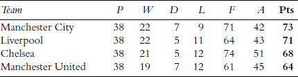

英格兰中场球员保罗·加斯科因（Paul Gascoigne）曾经说过：“我从不预测任何事情，也永远不会预测。”对我来说，这句话所蕴含的智慧，丝毫不亚于他在1996年欧洲杯对阵苏格兰时那记精彩进球。短短八个字，恰恰揭示了为何预测是不可避免的：前四个字他就错了——他其实刚刚预测了过去和现在；后四个字他又错了——他刚刚预测了未来。然而，尽管他说得如此错误，加扎却道出了一个深刻的道理。他精辟地总结了人生中一个极为深刻的真相：万物皆有规律。

我们在早高峰上班路上所需的时间是有规律的；我们与朋友社交网络的结构以及见面频率是有规律的；我们每天晚餐吃什么、在超市购买哪些商品也都有其规律。足球比赛当然也不例外。关键在于如何发现并理解这些规律。一旦我们看清了这些规律，就能开始做出预测。

## 随机的“苏布托”（Subbuteo）

我对规律的痴迷可以追溯到八岁那年圣诞节收到的一本厚厚的橙色硬皮足球统计年鉴。我会一坐好几个小时，翻看里面密密麻麻的数字。我尤其喜欢那种表格——横排和纵列都是球队名称，单元格里是两队在一个赛季中比赛的比分。我会沿着表格往下扫视，计算总进球数，寻找那些出人意料的结果。“4比3”是我最喜欢的结果，“5比2”听起来也不错。

如今我已没有那么多时间去细细研读足球年鉴了，但幸运的是，只需几秒钟，就能在网上找到所有比赛结果和积分榜。如果你尝试这样做，就能体会到加斯科因所描述的那种不可预测性。2012/13赛季的英超联赛便是一个绝佳例子——既有激动人心的比赛，也有出人意料的结果。利物浦曾两次以5比0取胜，另一次甚至赢了6比0，却仍未能获得欧战资格。那个赛季以亚历克斯·弗格森（Alex Ferguson）的退休告终，而弗格森素来以在最后时刻戏剧性地扭转局势闻名。他作为曼联主帅的最后一场比赛也不例外：西布罗姆维奇在最后十分钟连进三球，最终双方5比5战平。正如弗格森曾说过的那句名言：“足球，真是见鬼！”

这些比赛结果属于赛季中最令人难忘的精彩特例。当然，也有不少乏味的0比0平局，或许球迷们早已遗忘，但赛季统计数据却不会。然而，若我们希望理解足球背后的深层规律，就必须将这些平局也纳入分析。图1.1展示了2012/13赛季英超所有比赛的进球数分布直方图。平均每场比赛的进球略低于3个，确切地说是2.79个。

图1.1：2012/13赛季英格兰超级联赛进球数分布直方图。

该直方图显示了不同比分出现的频率。全赛季共有35场0比0平局，对应直方图最左侧的第一根柱子。弗格森的最后一场比赛是当季仅有的两场总进球数达10球的比赛之一，如图右侧所示。中间部分显示最常见的总进球数为3球，其中多数比赛的最终比分为2比1。规律已初现端倪。下一步便是探究这一规律的来源——为此，我们需要一个数学模型。

我对数学建模的兴趣几乎与对统计学的兴趣一样久远。在我沉迷于那本厚实的橙色足球年鉴的同时，我的另一大爱好是玩桌面足球游戏“苏布托”（Subbuteo）。我和朋友大卫·帕特森（David Paterson）组建了一个“苏布托”联赛。每天放学后，我们在晚饭前会打上五六场比赛，并记录每场比分。但我们始终没有足够时间完成整个联赛所需的全部380场比赛（20支球队，每队打19个主场，共20×19=380场）。一天的时间实在太短了。

受限于似乎认为我们必须吃饭和睡觉的父母，我和帕特齐（Patzi，即帕特森的昵称）不得不另想办法来完成联赛。答案就是掷骰子。帕特齐为一方掷一颗骰子，我为另一方掷一颗。然后我们各自将骰子结果减去1，作为该队的进球数。例如，如果阿森纳对阵曼城，他掷一颗红骰子，我掷一颗蓝骰子。若红骰子是5，蓝骰子是3，则阿森纳以4比2获胜。这个模型能产生0到10个进球的比赛，正好与英超直方图中的范围一致。

经过大量掷骰子操作，并对各自支持球队的比分稍作偏袒性调整后，我们根据掷出的数字填写比分，整理出联赛积分榜和统计数据，并工整地抄写在方格纸上。我想我注定要成为一名数学家（另一位大卫如今则成了一名成功的会计师）。

掷骰子是一种极为简单的数学模型，但存在几个问题。2012年圣诞节前夕，切尔西曾以8比0大胜阿斯顿维拉，这在我们的骰子模型中根本不可能出现。另一个问题是，现实中足球比赛出现0比0平局的频率非常高。在我们的模型中，0比0和5比5出现的概率相同，但在实际直方图中，0进球的概率几乎是10进球的20倍。因此，这个模型并不奏效。足球比赛并非像掷骰子那样完全随机。

但换个角度看，足球比赛又的确是随机的。足球和其他团体运动之所以令人兴奋，正是因为其不可预测性。观看比赛时，哪怕你低头几秒钟，就可能错过一次关键进攻和突如其来的进球。作为一名建模者，这一点给了我重要启示：在比赛的任何时刻，进球的可能性都是均等的。尽管影响球队进球速率的因素繁多，但进球发生的具体时间基本上是随机的。

我们可以将这一假设转化为模拟。想象一场足球比赛由90个一分钟的时间段组成，每个时间段内进球概率相同。若平均每场比赛进2.79球，则每分钟进球的概率为2.79/90 = 0.031。这意味着，在任意随机选择的一分钟内看到进球的概率约为1/32。虽然概率不高，但足以让你目不转睛。

利用这一模型，我们可以在计算机上模拟90分钟的比赛：每个模拟分钟以0.031的概率决定是否进球。如果我们对大量比赛反复运行该模拟，就能得到一个典型赛季的样貌。图1.2将这一模拟赛季的结果（实线）叠加在2012/13赛季英超真实数据的直方图上。

模型与现实的吻合度非常高。请记住这里涉及的所有复杂因素：教练在场边的嘶吼、球迷们为球队加油（或更常见的，指责他们无能）、球员心中默念“现在就是我进球的机会”……所有这些因素似乎并未影响进球分布。恰恰相反，正是这些因素共同作用，才产生了模型所假设的那种随机性。涉及的因素越多，进球的随机性就越强，我们的模拟直方图与现实数据也就越吻合。

图1.2中由我的模拟生成的实线被称为泊松分布（Poisson distribution）。这种分布出现在事件的发生时间彼此独立、过去事件不影响未来事件的情形中。这正是我在模拟中所做的假设，也恰恰符合足球比赛的实际情况：无论是已进多少球，还是已比赛多长时间，都不会影响下一粒进球发生的概率。由此产生的泊松分布惊人地成功捕捉了进球直方图的整体形态。正是每一分钟的不可预测性，催生了泊松分布——这是一种从纯粹随机性中浮现的规律。

图1.2：2012/13赛季英超进球数直方图（柱状部分）与泊松分布（实线）的对比。

我选择英超足球数据，并非因为事先知道它会符合泊松模型，而仅仅因为我热爱足球。实际上，我几乎可以选择任何得分时间自由的运动。为验证这一点，我查看了2012/13赛季NHL冰球联赛的所有比赛结果。在60分钟常规比赛时间内，平均每场进5.2球。图1.3展示了该赛季720场比赛的进球数分布直方图，实线为对应的泊松分布。

图1.3：2012/13赛季NHL冰球联赛进球数直方图（柱状部分）与泊松分布（实线）的对比。

更高的平均进球数使直方图的峰值右移，但模拟结果依然与数据高度吻合。数据与模型几乎没有差异，而四球比赛数量上的微小偏差，可归因于不同赛季间的自然波动。冰球比赛中进球更频繁，但其随机性并不比足球更高或更低。

## 被马踢死

一旦你开始用随机模拟和泊松分布的视角思考，就会发现它无处不在。在本科统计学课堂上，讲师最经典（也是唯一）的笑话就是：“公交车到站服从泊松分布。”公交公司虽有时刻表，但无数随机因素会干扰：老人上车动作缓慢，骑车人霸占公交专用道中央……另一个经典例子是你每年需要更换多少个灯泡。每次开灯时，灯丝都有微小概率烧断。将所有烧断事件累加，结果就服从泊松分布。

泊松分布以19世纪初法国数学家西莫恩·德尼·泊松（Siméon Denis Poisson）命名。但他最初强调的是分布背后的数学方程，而非其在现实世界中的应用。最早像我这样将其用于现实建模的，是一位在德国工作的波兰人——拉迪斯劳斯·博尔特基耶维茨（Ladislaus Bortkiewicz），时间是1898年。他研究了两组数据：第一组是一份令人不安的统计资料，记录了24年间10岁以下儿童自杀的人数；第二组数据稍好一点，但同样令人不适，涉及士兵因意外被马踢中或撞击致死的案例。博尔特基耶维茨考察了14个骑兵团在20年间的此类死亡人数。显然，他并不知道就在几年前，英格兰足球联赛刚刚成立——那本可为他提供所需全部数据，而无需深挖德国的死亡统计。

在这两组数据中，博尔特基耶维茨都发现了与泊松分布的良好吻合。被马踢死的事件很罕见：在他研究的280个骑兵团中，144个全年无一人死亡；但有两个不幸的骑兵团在同一年内各发生了四起死亡事件。通过拟合泊松分布，他证明这些骑兵团未必比其他团更虐待马匹——他们只是那一年运气太差。足球或许比生死更重要，也可能不然，但三者都遵循相同的规律。

当我面对新数据时，首先要做的一件事就是将其与泊松分布进行比较。有时同事会拿着新收集的实验结果走进我办公室，说：“太奇怪了！大部分鱼从未游过捕食者身边，但有一条鱼居然游过了四次！它肯定性格特别大胆之类的。”三分钟后，我就会画出泊松分布曲线，叠加到他的数据上，告诉他：“不，你的鱼并不特别大胆，这只是统计上的必然。”反复被捕食者追逐，就像遭遇5比0惨败——发生时看起来很糟，但谁都可能遇上。

泊松分布是我们遇到的第一个数学类比范例。它适用于众多情境：足球比赛、灯泡烧坏、甚至被马踢死。只要合理假设事件可在任意时刻意外发生，且与此前发生的事件数量无关，那么泊松分布就是合理的预期结果。

在足球之外，泊松分布的现代应用大多延续了博尔特基耶维茨的传统。统计学家似乎对死亡、伤害和事故有种反常的痴迷。或许只是因为我们付钱让他们去计算可能降临在我们身上的坏事，好让我们自己不必操心。无论出于何种原因，统计学家已在车祸、卡车相撞、头部损伤、飞机引擎停机、破产、自杀、谋杀、工伤事故、危险建筑工地数量中发现了泊松分布。他们甚至在1480年至1940年间爆发的战争数量中也找到了它。当他们不再关注死亡与伤害时，又在印刷错误、制造缺陷、网络故障、计算机病毒攻击和离婚数量中发现了泊松分布。凡有死亡、毁灭、不幸或错误之处，就能发现同一种随机性模式。

2015年，应用数学家克里斯蒂安·托马塞蒂（Cristian Tomasetti）与医学博士伯特·沃格尔斯坦（Bert Vogelstein）通过统计论证指出，三分之二的癌症病例源于“坏运气”。虽然某些癌症（如肺癌与吸烟）与生活方式相关，但这只是故事的一部分。更关键的是我们体内无法避免的细胞分裂过程。每次细胞分裂时，都有极小概率发生可能导致癌症的基因突变。克里斯蒂安和伯特发现，细胞分裂更频繁的身体部位更容易患癌，因此他们得出结论：癌症主要由这些随机突变解释。

这项研究引发争议：如果癌症纯属随机，为何还要投入巨资研究其成因？为合理使用“坏运气”一词并更好地解释结论，克里斯蒂安和伯特用了一个类比：开车时间越长，遭遇事故的可能性就越高。你如何驾驶固然重要，但开车时长同样关键。

足球类比同样适用，甚至可能更贴切。你可以将体内每次细胞分裂类比为足球比赛的一分钟。细胞分裂时，有（极小的）随机概率发生致癌突变，正如足球比赛中（较大的）概率会丢球。正是在这个意义上，癌症可被视为“坏运气”。有时我们的球队整场不失球，我们也希望一生无癌。虽然有时输球是因为对手强大，但没人能否认运气在单场比赛中的重要作用。我们的健康就像周六下午站在看台上观赛——并非所有失球都能避免。

并非我们遭遇的一切都归因于随机性。许多疾病可通过健康生活方式预防，失球也常因防守不力所致。但认识到生活中许多事情本质上是随机的，有时能帮助我们更好地面对人生挑战。生活并非全然可预测。

## 由随机性解释

正是足球比赛每一分钟的不可预测性，在90分钟后催生了泊松分布。我们知道一场比赛的平均进球数，但进球的具体时间无法预测。结果，某些比分变得远比其他比分更可能出现。这里的悖论在于：比分竟由随机性所解释。进球在时间上的高度随机性，反而使比赛结果呈现出可预测的模式。这个想法难以理解，却是事实。很多时候，某件事的极端随机性恰恰帮助我们解释它，并预测其发生频率。随机性使我们能够对未来做出各种预测。

数学家经常使用这一技巧。每逢新赛季开始、世界杯或奥斯卡临近，报纸常会报道某位“天才”数学家预测了某支球队或某部电影的获胜概率。这些预测常显得合理，有时也确实正确。但它们从何而来？

让我透露一个秘密：这些“天才”通常只是对泊松分布做了一些非常简单的处理，并结合了一些关于参赛球队或影片的背景信息。建模足球比赛结果的一种技巧是，计算每支球队的进攻效率（进球率）和防守效率（失球率），然后模拟它们之间的比赛。例如，在2012/13赛季英超中，阿森纳主场场均进2.47球，客场进1.32球；主场场均失1.21球，客场失0.74球。通过收集各队此类数据并模拟彼此间的比赛，我们就能对新赛季做出预测。表1.1展示了我利用2012/13赛季数据和模型对2013/14赛季前四名的预测。

表1.1：基于2012/13赛季各俱乐部进球率，对2013/14赛季前四名的第一次模拟预测。

这一预测与实际情况相差不远。现实中，曼城以两分优势力压利物浦夺冠，切尔西排名第三。但这只是我点击“运行”后计算机生成的众多可能前四组合之一。每次运行模拟，各队都会进行主客场对决，比分根据各自的进球率和失球率随机生成，再据此编制积分榜。每次结果都不同，有些差异极大。表1.2是另一次模拟的结果。

表1.2：基于2012/13赛季各俱乐部进球率，对2013/14赛季前四名的第二次模拟预测。

作为一名利物浦球迷，我更喜欢这个结果。它描绘了一个平行现实：在对阵切尔西的关键比赛中，史蒂文·杰拉德（Steven Gerrard）没有滑倒，利物浦最终赢得了近25年来的首个联赛冠军。杰拉德或许会带着这份积极能量助英格兰赢得世界杯，并被封为“爵士史蒂维·G”。既然存在大量可能的模拟现实，我自然会选择最喜欢的一个。

可惜，我内心那位客观的科学家觉得必须报告全部模拟结果。在我的笔记本电脑上运行10,000次英超联赛模拟只需几分钟，每次结果都不同。尽管每个平行现实都很有趣，但单独来看并不重要。重要的是汇总全部10,000次模拟的结果：各队夺冠频率如何？结果显示，利物浦在11.5%的模拟中夺冠；前一赛季的冠军曼联在26.2%的模拟中胜出；切尔西19.2%、阿森纳17.6%、曼城12.8%、热刺6.0%。

事后看来，这些预测略有偏差。曼联更换主帅后表现糟糕；曼城和利物浦大放异彩，双双进球超百。但这并非重点。我当然不会声称自己已构建出最佳足球模型。我们的故事才刚刚开始，我也不想一次性透露所有建模技巧。

关键在于，尽管这个基于随机性的模型并非完全准确，但也不全然错误。被预测为夺冠热门的球队，通常是那些一贯表现优异的队伍；上述积分榜看起来也像是某个赛季可能的结果，至少与我们的预期相差不大。而这一切几乎无需深入思考——我们只是假设进球随机发生（每队有不同的进球率），就得到了一个看似合理的前四名。这几乎完全颠覆了保罗·加斯科因对足球不可预测性的看法。足球其实非常可预测。每个英超周末，400多名球员奔跑90分钟踢球，赛季结束时，冠军总是一家来自伦敦或曼彻斯特的大俱乐部。

基于随机性的预测，是当今数学在社会中应用的重要组成部分。当你在电话客服队列中等待时，分析师早已研究过呼叫中心的来电频率，并计算出人们愿意等待的时长。银行向小企业或新购房者贷款前，也已计算出破产概率，并应用泊松分布预测未来几年需处理的破产案件数量。

预测并非要精确指出哪支球队会夺冠、你在电话中要等多久、哪家公司会破产，而是利用过去事件的频率来计算未来事件发生的概率。所有这些预测，最初都源于对德国士兵被马踢死事件的数学建模。若要用语言类比，你可以说：等待利物浦进球，就像在银行假日的周一等待19路公交车——等了好久不见踪影，然后一下子来两三辆。通过模型，我让这个类比变得有用。数学使我们能抓住公交车到站、足球比赛、破产、癌症病例和电话呼叫之间的共同特征，并据此预测它们的发生频率。

## 真实的故事

即使进球是随机发生的，数学仍能找到预测之道。但加斯科因也有道理。足球的真正故事并非关于随机性，而是关于超越随机性——关于挫折与逆转。2012年弗格森退休后，大卫·莫耶斯（David Moyes）带领曼联经历了二十多年来最糟糕的赛季，这无法用一连串坏运气来解释。2014年世界杯半决赛，德国在18分钟内连进五球击溃巴西，也并非随机进球序列的一部分。巴西在压力下崩溃，而德国抓住了机会。

弗格森或德国队的成功无法用随机性解释——我们需要深入探究其内在机制。讽刺的是，那些非随机的事件反而更难理解、更难预测，但也更有趣。

在我的研究工作中，缺乏随机性才带来最大挑战。几周后，我的生物学家同事又来找我：“没有捕食者时，鱼群随机分布；但一旦看到捕食者，它们就形成紧密旋转的鱼群。”现在，真正的谜题出现了：是某条鱼发起鱼群旋转吗？旋转速度多快？某些鱼是否偏好特定位置？为何鱼群旋转是躲避捕食者的最佳阵型？只有当随机模型失效时，问题才变得有趣。

在接下来的章节中，随着建模深入，我将探讨的问题将越来越不具随机性。球员移动高度同步，传球网络结构分明，球的运动遵循物理定律，教练则从战略高度思考战术。我们将考察的模型会截然不同，但我采取的基本方法始终如一：先进行观察，得出一组假设；再将假设转化为方程，通过计算机模拟和数学求解进行研究；最后将模型特性与现实世界数据进行比较。

应用数学家的挑战在于为所关注的问题选择合适的模型。若我们只关心预测一个赛季的总进球数，随机模型往往已足够。但若要理解阵型、移动和技巧，就需要理解结构。我个人对随机性解释并不满足——我想探究背后的真实机制。为此，我必须更贴近球员，仔细观察他们的行动。而这正是我们接下来要做的。