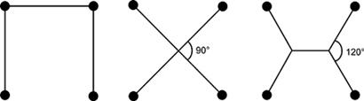

我父亲对足球的看法非常直白：足球就是抓住机会，避免犯错。在他看来，球在球员之间来来回回地传递，有时靠近一方球门，有时又靠近另一方。偶尔会出现一个机会——前锋处于有利位置，而同队中场恰好控球；一记穿透防线的传球，让防守队员措手不及；前锋稳稳接住球，将球送入网窝。接着比赛重新开球，整个过程又周而复始地开始。

必须承认，我父亲这套理论源自他长期观看苏格兰第三级联赛球队邓弗姆林竞技（Dunfermline Athletic）的经历。在东区公园球场（East End Park）度过的无数个下午，他目睹了“帕尔斯”（The Pars）历经无数阵容调整、教练更迭，也在联赛中升降起伏，但他几乎看不出球队风格有何本质变化。在他看来，足球比赛最终不过取决于进攻方偶发的灵光一现或是防守方沟通不畅；其余时间都显得混乱无序。

加里·莱因克尔（Gary Lineker）、阿兰·汉森（Alan Hansen）等职业电视评论员或许会不同意我父亲的观点，哪怕他们被迫观看一场邓弗姆林对阵考登比斯（Cowdenbeath）的本地德比战。但当我回苏格兰探望父母，周六晚上一起看《每日比赛集锦》（Match of the Day）时，我却能理解父亲的观点。电视评论总是聚焦于前锋们所谓的“精彩发挥”或“天才表现”，或是指责后卫“糟糕透顶”“令人震惊”的防守失误。整场讨论围绕进球和错失良机展开，一两名球员被捧为英雄或贬为罪人。战术安排仅在赛前以阵型图形式简略提及，随即被抛诸脑后，注意力迅速回到个人身上。

如果说我从约翰·萨姆普特（John Sumpter）身上学到了什么，那便是思想上的诚实。他敢于说出许多人心中所想却羞于承认的话。在某种程度上，他是对的：即便你每周都去现场观赛，也很难真正看清球场上究竟发生了什么。我们已经看到，随机性在进球中扮演着重要角色；而我父亲则更进一步：他认为足球比赛令人惊讶、出人意料的本质，恰恰源于这项运动缺乏真正的结构。对他来说，决定比赛胜负的是瞬间的斗志与个人技术，抑或是注意力涣散与粗心大意。战术固然存在，但教练最重要的工作，是激励球员在关键时刻拿出最佳表现。曾把职业生涯大量时间花在等待对方防守失误、伺机射门的加里·莱因克尔，或许有时也会和我父亲产生某种共鸣：阵型和团队结构究竟有多重要？难道不是个人技术决定比赛结果吗？

要理解结构，我们需要“拉远镜头”。当我研究鱼群、鸟群或哺乳动物群落时，我不会一开始就聚焦于某个体动物，而是采取广角视角，从远处观察整个群体——比如椋鸟群的盘旋舞动、鲭鱼群的密集翻滚，或是羚羊群在狮子追击下急速奔逃的整体动态。唯有站得更远，我们才能看清群体整体的行为模式。然而，通过电视观看足球比赛时，这种宏观视角很难获得：摄像机始终追随着皮球，并聚焦于明星球员，整体画面因此丢失，而个体细节却被放大。

如果我想说服父亲足球确实存在真正的结构，就必须从鸟瞰视角开始。

## “1–2–7”阵型的消亡

我们能对足球采取的最宏观视角就是阵型。阵型通常以如4–4–2、3–5–2或3–4–3等形式表示，其中数字分别代表防守队员、中场球员和前锋的人数。更复杂的体系，比如强调控球的4–2–3–1，或中场呈“钻石”结构的4–1–2–1–2，则反映了球队希望在中场区域如何组织比赛。这些阵型大致勾勒出球队的战术意图和球员角色。

阵型是足球结构重要性的第一重证据：某些布局确实比其他布局更有效。在1872年历史上首场国际足球赛（英格兰对阵苏格兰）中，双方均采用了攻击性极强的阵型：英格兰为1–2–7，苏格兰为2–2–6。尽管两队都堆砌前锋，却相互抵消，最终0比0互交白卷。

自那以后，足球发生了巨大变化。部分变化源于规则调整：当时规定进攻球员必须有至少三名防守球员位于其与对方球门之间，才算不越位。这也解释了为何英格兰排出七名前锋——他们在整条前场布下越位陷阱。但即便在规则未变的时期，阵型也持续演变。图2.1展示了足球史上四支伟大球队的阵型：1950年代的匈牙利国家队、1960年代的国际米兰、1970年代末的利物浦，以及2010/11赛季的巴塞罗那。

图2.1：足球史上四种阵型网络。1953年匈牙利阵型中，希代古提（Hidegkuti）位于四名前锋正后方的居中位置。2010/11赛季巴塞罗那阵型中，梅西（Messi）担任三前锋中最居中的角色，伊涅斯塔（Iniesta）与哈维（Xavi）分别占据中场左、右，布斯克茨（Busquets）则位于后防线前方的中场核心位。

这些阵型图的呈现方式与电视赛前分析中常见的略有不同。首先，我移除了球员姓名，以便突出整体结构；更重要的是，我添加了连线。这些连线基于一种名为“最小生成树”（minimum spanning tree）的技术计算得出：我分别计算了连接所有球员的最短网络和次短网络，若两名球员同时出现在这两个网络之一中，便在他们之间画一条连线。通过这种方式连接球员，我们可粗略了解球队计划如何传导球权。

观察球队网络，我们便能看出过去60年间足球战术的演变。首个阵型来自1950年代伟大的匈牙利队，取自1953年他们赴伦敦与英格兰进行友谊赛时的配置。在匈牙利网络图中，位于前锋线后方中央的球员是南多尔·希代古提（Nándor Hidegkuti）。他位置灵活、连线众多，能以英格兰根本无法应对的方式串联全队。最终结果是主队英格兰以3比6惨败。匈牙利的第六粒进球——希代古提上演帽子戏法的一记凌空抽射——正是一连串六次颠球后，从目瞪口呆的英格兰球员头顶传过来的。

1960年代国际米兰的阵型常被称为“网”（the net），网络图正好解释了这一名称的由来：中场与后防形成错综复杂的连线，令对手难以穿插渗透。严密的防守使国米得以发动快速反击。1970至80年代的利物浦则在球场上布满直角三角形，支撑其标志性的“传跑”（pass-and-move）风格。这是一种简单却高效的体系，球员在其中成为可互换的系统组件。虽在英格兰与欧洲赛场屡获成功，但利物浦网络的僵硬性使其显得不够优雅。与之对比，2010/11赛季的巴塞罗那则不同：哈维与伊涅斯塔构成一连串大角度三角形的环节，梅西则位于一个菱形结构的顶端。

所有这些阵型都含有三角形，但巴塞罗那阵型中的三角形尤其符合数学审美的眼光。如果你将队中任意一名球员绕其自身旋转360度，会发现他四周各个方向都有均匀分布的传球选择。例如2010/11赛季担任后腰的塞尔吉奥·布斯克茨（Sergio Busquets）或哈维尔·马斯切拉诺（Javier Mascherano），拥有五个传球选项，每个选项都构成一个三角形的边：他可直接回传，也可向两侧斜向前或斜向后传球。每位球员都像一个枢纽，球从一个角度流入，可迅速从另一个角度传出。这正是巴塞罗那最擅长之事：控球并快速在球场上传导球权。

## 轨道三角形

巴塞罗那或许打造了足球史上最佳的三角形体系，但三角形解决实际问题的历史远早于足球诞生。试想如下问题：你是一市之长，城市包含若干郊区，你想修建一条铁路将所有郊区连接起来。但你预算紧张，希望用最短的轨道实现连接。你该如何用最少的轨道连接所有郊区？

图2.2展示了连接四个郊区（以圆圈表示）的三种可能方案。请思考哪一种使用的轨道总长度最短。若稍用一些中学三角学知识，我们便可算出答案。左侧方案使用三个单位长度：每边长为1个单位，连接全部共需3段。

图2.2：连接四个郊区的三种潜在方案。

中间方案在中心增加一个枢纽点，将区域划分为四个等大的三角形。两条交叉线段的长度可用勾股定理算出，总长度为2倍根号2，约等于2.82。此方案类似匈牙利队让希代古提在中场与前锋之间自由活动，也类似巴塞罗那对梅西的使用方式：增设额外连接点，通过三角形降低总连接长度。

若一个额外连接点已然有益，那么使用两个则效果更佳。右侧结构的总长度仅为1+根号3，约等于2.73，少于其他两种方案。此方案同样涉及三角形：连接点处伸出三条分支，彼此夹角120度。数学中常有此规律：最美观、最平衡的形状往往就是最优解。

连接正方形四个顶点的问题尚且不简单（我不确定有多少市长能解出）。但这才刚开始。若你想真正挑战自己，不妨试试连接正五边形五个顶点的问题。答案依然涉及三角形，但关键在于如何排列它们。一旦完成五点，再试正六边形的六个顶点。此时会出现一种全新类型的解法，但仍离不开三角形。（具体解答见第277页注释4。）

现在，我们把郊区连接问题变得更困难些：假设你并不知道所有郊区的位置，甚至不知道需要连接多少个点。这正是黏菌（Physarum polycephalum）面临的问题。黏菌没有大脑，仅由单细胞构成；其“身体”是由相互连通的管道组成的网络，用于来回泵送养分。它们通常出现在森林地面或树干上，一般覆盖面积小于一枚硬币，但也能迅速扩张——在食物充足时扩展，环境恶劣时收缩。

当黏菌寻找食物时，就必须解决上述郊区连接问题。受此启发，我的日本同事中垣俊之（Toshi Nakagaki）决定测试黏菌能否构建出东京轻轨与地铁网络。他和同事在培养皿中按比例摆放燕麦片：中央放一大片代表东京市中心，周边较小燕麦片则对应涩谷、横滨、千叶机场及其他近郊区域。黏菌若要连接这些燕麦片，就必须解决当年日本城市规划者设计东京交通系统时所面对的相同问题。黏菌真能高效连接这些食物资源吗？

实验效果极佳。黏菌毫不费力地构建出由三角形组成的网络，将所有燕麦片连接起来。中垣将黏菌的解决方案与真实的东京轨道交通网络对比，发现二者虽不完全相同，结构却高度相似。黏菌方案的效率与人类规划者相当，连接各郊区燕麦片所用的连接数量也大致相当。图2.3展示了黏菌与人类网络的对比。

图2.3：黏菌构建的燕麦片连接网络（左）与真实东京轨道交通网络（右）对比

三角形交汇点是黏菌管道网络的核心特征。某些燕麦片成为连接枢纽，将其他节点串联起来，以保持总管道长度最小。注意，与足球阵型类似，这些交汇点处的角度较大，网络向各个方向均匀展开。黏菌并未构建绝对最短的连接网络，而是额外保留了一些环路，为同一对节点提供多条路径。中垣及其同事证明，这些环路在遭遇破坏时极为有用：若网络中某一段断裂，黏菌仍可通过替代路径维持连接并输送养分。这类似于地铁某段发生故障时，若系统设计良好，整个网络无需全面停运。

## “tiki-taka”镶嵌

黏菌网络与铁路系统在物理上与足球阵型截然不同。足球队并不会用黏液管道或钢轨标记传球路线，他们靠的是相互传球。但其间存在若干惊人的相似之处。其一是“用三角形覆盖世界”的理念：黏菌覆盖森林的一小片区域，巴塞罗那用潜在传球覆盖整座球场，高效的铁路系统则用轨道覆盖全国。另一重要相似点在于连接枢纽处各方向选项之间的夹角很大。若绕黏菌或铁路网络的中心点旋转360度，会发现各方向的选项均匀分布，正如我们在巴塞罗那阵型中所见。

宽角三角网络与空间高效利用之间存在数学关联。我为著名足球队构建的三角化网络，也可用于观察球队如何将球场划分为不同区域。以巴塞罗那为例，图2.4展示了其2010/11赛季的区域划分。左侧为球员网络（实线）及其产生的区域（虚线）；右侧则移除网络，仅保留区域，并标注2010/11赛季各球员通常所在区域。

图2.4：2010/11赛季巴塞罗那网络与区域划分。左侧为球员网络（实线）与区域（虚线）；右侧为各球员赛季典型站位。

巴塞罗那4–3–3阵型所形成的区域拼图与其传球网络同样具有对称美感，这绝非巧合——而是数学必然。若一支球队构建宽角三角网络，必然将其活动区域划分为间距合理的区域；反之，若每名球员占据明确空间，则必然形成宽角三角网络。这一点至关重要：它告诉我们，解决其中一个问题，也就同时解决了另一个。若球队能良好覆盖空间，球员便会发现大量优质传球选择；若他们为接球而移动，也会顺势创造出空间。球员无需计算所有队友的角度，只需确保自己有足够空间接球并传出即可。

对称性正是巴塞罗那所采用的tiki-taka风格的关键。tiki-taka足球的核心在于球员间快速传球，旨在制造对方防线的失衡。要从数学角度理解tiki-taka，我们需要更深入理解区域的定义方式：若某名对方球员距离伊涅斯塔比其他巴塞罗那球员更近，则称其位于伊涅斯塔的区域。图2.4中的每条虚线均为两个区域的边界：站在该线上时，对方球员与两名巴塞罗那球员距离相等。

假设我站在伊涅斯塔与梅西区域的边界线上，与两人等距。在这种情况下，我大概率处于球场上最不利的位置——尤其当梅西持球时。若我上前逼抢梅西，球会迅速传给伊涅斯塔；若我退防伊涅斯塔，梅西则可自由前插。图中的边界线恰恰告诉对方球员：防守巴塞罗那时，绝不要站在这些线上。身处此地，无异于陷入足球的“无人区”。

## 弹性区域

铁路网络几乎没有弹性。一旦决定修建约克至伦敦或横贯西伯利亚的线路，便无法更改。黏菌更具适应性：当食物短缺或网络某部分遭遇危险时，原有连接会收缩，新连接在别处形成。但这些变化仍需数分钟甚至数小时才能完成。

足球网络则必须高度灵活。前进路径瞬间被封堵，新机会在电光火石间出现。若球员坚持等到最近队友完全摆脱盯防才传球，恐怕很快就会丢球。球队结构必须迅速响应瞬息万变的局势。尽管球队可从特定阵型起步，但必须能快速调整形态以适应局势变化。若对手比你更早抓住机会，很快你就会陷入被动追球而非主导传球的局面。

球场上层出不穷的移动与反移动，正是难以发现规律的原因。我认为这正解释了我父亲足球理论的由来：变化太快，他无法跟上节奏。顶级球员已在训练中投入数万小时，打磨出近乎本能的反应。他们似乎能凭直觉应对比赛，迅速找到更佳的攻防位置。对我们许多观众而言，很难看清他们要去哪里、在做什么；但对他们而言，这已如呼吸般自然。

若想看清结构，父亲只需上YouTube观看巴塞罗那2008至2012年间的集锦。视频通常聚焦于梅西突破茫然失措的后卫，他确实引人注目。但真正值得关注的并非梅西本人。建议下载视频，用慢速播放，观察他队友如何围绕他移动。通常，他会直接将球传给伊涅斯塔或哈维，随即前插；一秒钟后，球又回到他面前。在他们最精彩进球的构建过程中，巴塞罗那往往完成四五次这样的直接传递。现在，暂停视频于梅西传球的确切时刻，观察他队友的位置。

图2.5上方展示了2010年欧冠联赛巴塞罗那对阵希腊冠军帕纳辛奈科斯（Panathinaikos）一役中的场景。梅西持球向球门推进，两名帕纳辛奈科斯球员正上前拦截。传球三角形显示了梅西的选择：哈维正对梅西，伊涅斯塔在其左侧。我们已能看出他们的站位极佳——两人均可直接接球。但若观察图2.5下方的球员区域划分，便会发现这些位置的精妙之处。

两名位于梅西与哈维之间的防守球员正站在“无人线”上。他们虽向梅西冲去，但为时已晚——梅西此时向前直塞极易成功。哈维回传，两秒后梅西再度持球。这一“撞墙式”配合本身不过是操场足球的基本功。但之所以能实现，正得益于梅西、伊涅斯塔与哈维对帕纳辛奈科斯禁区前沿区域的划分。对方球员被迫站在这些区域的边界线上，无法判断究竟该上前逼抢，还是盯防接球者。

图2.5：梅西进球前5秒，巴塞罗那在帕纳辛奈科斯禁区外的站位。巴塞罗那自下而上进攻。巴塞罗那球员以灰色圆圈标示，帕纳辛奈科斯球员为空心圆圈。箭头表明两名防守球员正冲向梅西。上方为传球三角形（球员间直接连线）；下方为球员区域（虚线）。

图2.6：梅西进球前三秒，巴塞罗那球员在帕纳辛奈科斯禁区外的站位。符号说明见图2.5。

整个过程不到两秒。梅西再度持球时，球员已形成新阵型，如图2.6所示。两名防守球员飞身扑向梅西，但已太迟。此前被盯防于禁区角上的佩德罗（Pedro），此时前插创造出新区域。球员间距仅数米，但佩德罗已摆脱盯防者，精准站位于剩余四名防守球员的几何中心。其中一名防守球员站在梅西与佩德罗的“无人线”上，另一名处于佩德罗与哈维之间，第三人则卡在三人交汇的角落。佩德罗在极小空间内创造出最大可能的区域。梅西将球传给佩德罗，后者轻巧回敲，梅西随即单刀赴会。整套传球配合仅耗时4秒，1秒后，球已入网。巴塞罗那3比1领先，并最终5比1取胜。

加里·莱因克尔或许会称此为一次“精彩突破”，阿兰·汉森则可能归咎于帕纳辛奈科斯防守松懈。但真正发生的是基础几何学的应用。古希腊人开创了形状与位置的数学研究；这些巴塞罗那球员则将其付诸实践。他们已掌握在禁区前沿创造空间的艺术。多数进球并非源于某个天才灵光乍现，也非防守方偶然分神，而是源于球队对足球比赛方式的精心规划。无论我父亲如何认为，当足球被正确演绎时，进球正是球员作为团队所构建结构的自然结果。只要我们放慢比赛节奏，观察其中的模式，便能理解为何某些球队如此成功。

## 运动法则

2010年，巴塞罗那无疑给希腊人上了一堂几何课。但球员们真在进行数学计算吗？瓜迪奥拉（Pep Guardiola）是否在赛前与全队一起复习了几种三角剖分与镶嵌算法？尽管瓜迪奥拉堪称天才，我仍怀疑他是否告诉哈维、伊涅斯塔、佩德罗和梅西：“去构建一个Delaunay三角剖分，使对方球员恰好落在其对偶Voronoi图的边上。”这四名球员均毕业于巴塞罗那著名的拉玛西亚（La Masia）青训营。该学院以足球教育闻名世界，但课程中可不含计算几何的本科内容。尽管如此，球队却的确构建出了这些几何结构——巴塞罗那运用了高级几何学。

但运用几何学并不需要完整掌握其数学原理。鱼群同样“运用”了大量几何形状。远距离洄游时，鲻鱼会形成椭长队形，前方个体密度更高；遭遇捕食者时，沙丁鱼则聚成旋转球体，迅速远离饥饿的剑鱼或其他掠食者。但高效而优美的集体模式，并不意味着鱼群理解其背后的数学原理。它们甚至可能不清楚自己此刻形成了何种队形。身处旋转鱼群中央的鱼，只看到四周许多鱼在向前游动。它无法判断鱼群规模，甚至可能意识不到自己正绕圈游动。

鱼只是遵循少数邻近个体的动向，随波逐流。它们不会说“我们绕圈游”或“我们排成椭长形”，而是遵循一套简单游动规则。鱼主要对视野内少数邻近鱼的运动做出反应：调整速度以保持群体聚集，减速避免碰撞，加速以防掉队。当一条鱼突然转向，周围鱼群便会跟随。研究者发现，这些互动往往比我们最初设想的更简单：仅靠速度调节与位置反应的简单策略，效果优于需计算所有邻居位置的复杂方案。

鱼类采用的简单规则，为我们思考足球中的组织方式提供了起点。人类大脑在追踪周围物体运动方面，并不比鱼脑高明多少。我们只能详细追踪少量物体，且物体移动越快，能掌控的数量越少。因此，尽管足球球员能快速应对球场变化，却无法精确规划全队阵型。当防守越位陷阱时，后卫需紧盯彼此与对方前锋，却不可能同时知晓全部22名球员与皮球的位置。

球员必须采用与队友互动的简单规则：何时加速、何时减速，如何利用空间、如何响应队友。正如自然选择塑造了鱼类的互动方式，职业球员在训练场上数以千计的小时，同样塑造了他们在球场上的移动方式。前阿贾克斯与巴塞罗那主帅里努斯·米歇尔斯（Rinus Michels）曾强调，仅练习“撞墙”传球与射门训练，并不足以培养梅西对哈维与佩德罗所展现的那种技能。教练应设计练习，教导球员“在电光火石间识别出何时该打‘撞墙’配合”。这类练习旨在培养球员对比赛的“直觉”，使下一步行动水到渠成。

当梅西冲向帕纳辛奈科斯球门时，哈维、伊涅斯塔与佩德罗并未开始计算防守方的三角剖分或镶嵌结构。他们甚至可能未作任何思考。他们只是遵循一条简单规则：跑位接应，将球直传脚边。如今在赛后分析中，我固然能欣赏他们所构建传球网络中的数学规律，但这实则源于他们所采纳的比赛风格。正如鱼群遇险时的爆发性散开源于个体运动，足球进球也源于球员执行的一套简单动作。

梅西所进的这粒球，以及许多类似进球，都源于多年前确立的一套规则。当巴塞罗那效仿阿贾克斯建立拉玛西亚青训营时，他们引入的是一套已在阿姆斯特丹、乃至历经数百万年演化验证的体系。黏菌精通三角形，鱼群精通速度变化与空间利用。巴塞罗那希望培养能掌握所有这些技能的球员。拉玛西亚无需教授高等几何，只需确保年轻球员掌握正确的运动法则。这些法则在训练场上确立：学习传跑配合、转身变向。当梅西发现自己身处禁区外，面前有九名帕纳辛奈科斯球员阻挡时，他无需思考——他只是做出了于他而言最简单、最自然的动作。