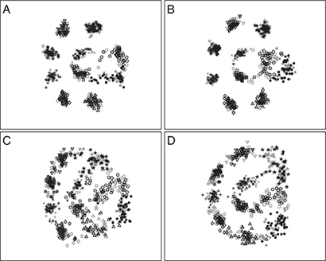
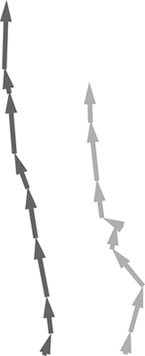
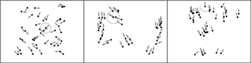
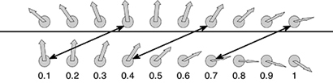
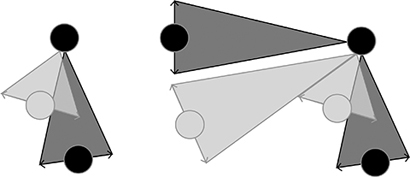
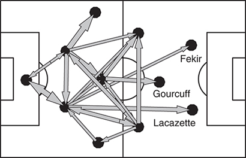

每个学术研究领域都会创造出自己的小世界。研究人员会对某个对象进行极其细致的研究，比如鱼群如何根据其他鱼的位置做出反应，或者蚂蚁路径的形状如何形成，然后便沉浸其中。他们争论在鱼转向反应中，位置、速度还是朝向哪个因素更重要；他们也会就蚂蚁信息素的化学成分展开讨论。

我不得不承认，我自己有时也会陷入这种微小的学术微观世界中。眼下是足球，但在此之前我曾沉迷于鱼群运动，再早之前则是蚂蚁路径。专注于某个主题并深入细节之中，确实有一种令人着迷的魅力。但这种对细节的执着，也可能让我们科学家过于沉浸在自己的世界里，用只有同行才懂的语言彼此交谈，却忘了外面还有其他同样精彩的世界。

因此，当我发现足球研究者其实在我开始研究足球之前就已经注意到了我关于鱼和蚂蚁的研究时，感到非常惊喜。在我刚开始写这本书后不久，我上谷歌学术（Google Scholar）搜索，想看看专业的体育科学家们在做些什么，了解他们的研究世界是什么样子。结果让我大吃一惊。我看到的第一篇论文之一，就是一篇题为《运动队作为超有机体》（Sports teams as superorganisms）的综述，作者是里斯本的里卡多·杜阿尔特（Ricardo Duarte）及其同事。他们采用了我和上一章所用的相同类比，将球队比作蚂蚁，并指出：“团队表现分析可以从用于解释个体间重复互动如何产生涌现性社会集体行为的生物模型中获益。”不仅如此，他们引用的主要文献之一，正是我2005年发表的一篇综述文章《集体动物行为的原理》（The principles of collective animal behaviour）。体育科学家们早已开始借用我的研究成果来启发他们对团队的思考。

我撰写科学论文，是希望自己的发现能被广泛领域的人阅读，而不仅限于自己所在的学科。2005年时，我对足球的兴趣仅限于偶尔在大学体育中心踢踢五人制“随到随踢”比赛，以及在电视上关注利物浦在欧冠联赛中的表现。我的综述文章里当然没有提到足球这项运动。因此，几年之后，里斯本的研究人员能从我的文章中获得灵感，让我尤其感到欣慰。

里卡多·杜阿尔特和里斯本的研究团队并非唯一从生物学中汲取灵感的人。巴塞罗那大学的纳塔莉亚·巴拉圭（Natalia Balague）教授写道，团队运动的训练练习不应“告诉运动员理论上理想的动作输出，而应设计出能让他们在不断变化的情境中运用技能的任务”。她引用了一位西班牙著名教练的话来形容他的球队：“当我看到他们像鸟群一样移动时，我就知道他们打得很好。”体育数据分析公司Prozone的首席数据科学家保罗·鲍尔（Paul Power）在向足球俱乐部做报告时，开头通常会播放鱼群游动的视频。他的演讲随后从海洋转向球场，强调球员追球与沙丁鱼躲避鲨鱼之间相似的动力学特征。

我在本书中构建的许多数学模型，都借鉴了动物运动的类比：巴塞罗那创造空间的方式与鱼群队形相似，狮子捕猎与霍尔格·巴德施图伯（Holger Badstuber）压缩空间的方式类似，蚂蚁群体的超线性合作也映射到球队协作之中。而体育研究者似乎也开始以与我相同的方式思考问题。动物行为模型正在被用作团队表现的模型：我们可以借鉴研究动物协调与运动的方法，来提升足球运动员的协调与运动表现。

## 数据洪流

图9.1显示了纽伦堡预备队一场八人制训练赛中某一时刻16名球员的位置与运动方向。浅色队的左边锋此时持球，正寻找向前传球的机会。球场中央，两名深灰色防守队员正在盯防两名浅灰色进攻队员，同时确保自己保持造越位的防线。

图9.1：纽伦堡预备队训练赛中球员的位置与运动方向。圆圈表示两支对立浅色与深色球队球员的位置，箭头表示球员移动的方向与速度，箭头越长表示速度越快。小黑点为足球。

这次训练赛意义特殊，因为这是最早一批实时足球追踪数据被公开使用的案例之一。所有球员双脚都装有传感器，用于测量脚的位置；足球内部也装有传感器，守门员的手套同样配有传感器。脚部和手部位置每秒测量200次，而球的位置每秒测量2000次。这产生了每秒8400个三维位置数据点。最终，60分钟的比赛生成了一个6GB的数据集——包含近1.2亿个数字需要处理。

这是当今足球正面临的“信息爆炸”的一部分。在一场正式比赛中，以每秒200次的频率追踪22名球员，同时以每秒2000次的频率追踪足球，在95分钟内采集三维坐标数据，将产生：

而这还只是一场比赛的数据。一个英超赛季将生成近1000亿个数据点。

几年前，一位英超球队主教练周六观看自己球队的比赛。周日，他会回看下一场比赛对手最近几场的录像，同时也会浏览联赛其他球队的集锦。如今，他可以获取自己球员和对手球员数以百万计的数据点，还包括训练表现数据以及所有球员的体能指标。他的任务是从这数十亿个数字中提炼出几句话，清晰地向球员解释下一场比赛的战略。

因此，足球俱乐部如今纷纷聘请专家，以最大限度地利用所收集的数据，也就不足为奇了。曼城拥有一支庞大的分析团队，在每场比赛后汇总球队表现数据，从而识别球队在球场哪些区域表现良好、哪些区域存在问题。利物浦体育分析主管伊恩·格雷厄姆（Ian Graham）拥有剑桥大学理论物理学博士学位，他为主力门将和前锋提供详细的站位分析，说明不同位置对进球概率的影响。拜仁慕尼黑则建有一个庞大的数据库，记录了所有球员在每场比赛甚至许多训练课中的移动轨迹。每场比赛后，拜仁比赛分析主管迈克尔·尼迈耶（Michael Niemeyer）都会在“报告厅”为教练组做一次高科技数据演示。拜仁球员还可以在一个类似Facebook的内部论坛上就比赛数据和战术进行交流评论。每一家顶级俱乐部如今都有自己的数据专家。

这些专家面临的挑战，是如何将数以百万计的数字转化为一幅富有信息量的图像。这幅图像必须能概括一场比赛的精髓，就像我在第七章中绘制的战术地图一样，但这次是基于数百万个测量数据构建而成。

美国迪士尼研究所（Disney Research）的阿莉娜·比亚尔科夫斯基（Alina Bialkowski）及其团队正积极应对这一挑战。迪士尼为何要研究“足球”（soccer）目前尚不清楚，但他们确实在这个问题上取得了良好的开端。

在他们最早的一项研究中，阿莉娜和同事们专注于利用数据识别阵型的细微差异。他们在一篇科学论文中并未透露所分析的是哪个顶级联赛，但可以确定这是一个以4–4–2阵型为主导的国家联赛。图9.2展示了四支球队在一个赛季中采用的阵型实例。每个微小符号代表一名球员在整个赛季每半场的平均位置。例如，在左上角的球队A中，左后卫是一簇三角形，而两名前锋则是前方的一团圆形与菱形模糊区域。

图9.2：一个赛季中研究的球队阵型。符号表示一名球员在每个半场、每场比赛中的平均位置。图由阿莉娜·比亚尔科夫斯基及其同事原始图改编。

不同球队以不同方式执行4–4–2阵型。其中一些变化是广为人知的战术。例如，球队A的两名前锋平行站位，而球队B则是一名拖后前锋与一名突前前锋的组合。但这些阵型之间的其他差异则更加微妙。球队C在进攻中比A和B更具灵活性，其一名前锋在拖后与搭档突前之间切换。球队C在中场也展现出多种站位方式，整体阵型更为分散。球队D则在3–4–3与4–4–2之间切换，并在进攻时不断变换阵型。

识别阵型只是第一步。在后续一篇论文中，迪士尼研究人员进一步分析了不同进攻情境转化为进球的可能性。他们每十分之一秒计算一次多种位置特征，包括防守球员偏离其常规位置的程度、球员移动速度，以及持球进攻球员与球门之间防守球员的数量。基于这些特征，研究人员发现反击往往提供了最佳的进球机会——对手发起进攻的时刻，正是本方策划反击的最佳时机。该模型仍在不断完善中，但最终目标是为每种比赛情境提供转化为进球的概率。教练可据此设计自己的战术，并识别对手特别危险的区域。

## 阵容动态

足球分析的下一个挑战，是从对静态阵型与站位的描述，转向对球员互动的动态分析。让我们回到纽伦堡预备队的八人制训练赛。图9.3显示的是图9.1所示时刻约一秒钟之后的情景：左边锋已将球传向右侧。此时几乎所有球员都在朝同一方向奔跑，只是速度不同。靠近中心区域的球员移动最快，因为他们离原位最远。

图9.3：纽伦堡预备队训练赛中球员的位置与运动方向。该快照拍摄于图9.1所示时刻之后约一秒钟。

我们可以通过叠加所有球员的运动方向来衡量球队的协调程度。如果将每个方向箭头首尾相连地堆叠起来，就会得到图9.4中所示的两支球队图像。这种堆叠方式展示了球队成员在多大程度上朝同一方向移动。两支球队的球员都彼此对齐，但防守方（深色队）的协调性略高于进攻方（浅色队）。整个防守球队协同移动，以防止不必要的空隙出现。而持球进攻方的情况则不同：进攻型中场球员跟随比赛方向移动，但左后卫和左边锋则以不同方式移动，以创造空间，使比赛方向能再次改变。

图9.4：通过叠加各球员方向箭头来衡量两支球队的对齐程度。

协调移动是成功防守的关键。这从后防线四人同步前压开始，但对全队都至关重要。通过在球场上均匀分布，防守方形成一张“网”，阻止对方进一步推进。这种协调一部分通过盯球实现，但也依赖球员彼此追踪，以保持这张“网”的紧密。

乍看之下，似乎保持紧密的防守网需要球员追踪所有队友。然而早在1995年，塔马斯·维切克（Tamás Vicsek）及其同事就开发了一个模型，表明即便没有球可追随、甚至对队友位置和方向仅有极有限的了解，群体对齐仍可实现。

想象你正在一个100米×100米的场地上奔跑（面积略小于两个标准足球场），与另外43人一起（正好是标准足球比赛人数的两倍）。你们各自以12公里/小时的速度奔跑——这是相当快的慢跑速度。这个场地有一个奇特的属性：如果你从一边跑出场外，就会从对边重新进入。比如从顶部跑出去，会从底部重新出现；向左跑太远，则会从右边重新现身。当然，现实中不存在这样的球场，但你此刻正身处一个数学模型中，因此允许一些奇怪的假设。

根据塔马斯的模型，你应该观察离你最近的邻居——比如当前10米范围内的那些人——并开始朝他们移动的方向前进。假设其他43名参与者也都这样做，会发生什么？图9.5展示了44人在此场地中奔跑1秒、20秒和2分钟后的模拟位置与运动方向。

一开始（图9.5左侧），所有人朝向随机方向。中间的灰色圆圈代表你的位置，并标出10米半径内的邻居。你开始朝最近邻居的方向前进。20秒后（图中），小群体已经形成。你所在的群体正朝左上方移动，但其他群体则朝不同方向移动。两分钟后（图右），你已绕场地跑了好几圈。尽管你仍只跟随少数邻居，但整个场地的人已大致朝你相同的方向移动。

图9.5：44名模拟人员在具有“传送”边界的场地中奔跑的位置与方向。模拟结果分别在1秒（左）、20秒（中）和2分钟（右）后。灰色圆圈表示你的位置及你所跟随的其他人。

不到两分钟，全部44人便实现对齐；甚至在20秒后，大多数人已朝同一方向移动。你和其他人无需领袖、无需语言交流、无需计划，仅凭大致跟随邻近者的方向，群体便自动协调。

你可以亲自做这个实验：找一些人和一片空地，让他们大致跟随附近人的方向奔跑。由于你可能没有从上到下的“传送器”，得告诉他们留在场地内。但结果会类似：很快你们就会形成顺时针或逆时针的环形运动，彼此跟随绕圈。

在塔马斯的模型中，场地边界的“传送”特性意味着运动方向不受限制。这重现了身处庞大椋鸟群或蝗虫群中心的感觉。例如，黄昏时的椋鸟群（murmuration）可包含数千只鸟，但每只鸟仅对附近几只做出反应。同样，飞蝗群可覆盖数十甚至上百平方公里，但每只蝗虫主要只响应几厘米范围内的邻居。塔马斯的模型有助于解释：为何这些群体能在没有外部信号（如风向或太阳）指引的情况下形成统一方向。蝗虫无需追随风或太阳——仅靠局部互动就足以让整个群体朝同一方向前进。

塔马斯的模型已在蝗虫、鱼群、鸟类及其他动物中得到广泛验证。不同物种的互动细节各异，但原理相同：邻近个体间的局部互动使整个群体实现协调与对齐。这对足球运动员来说是个好消息。如果小脑昆虫能在数月内于广阔地域组成庞大群体协同移动，那么让11名球员在90分钟内于足球场上统一行动，应该并不困难。塔马斯的模型意味着，球员无需追踪所有队友及对手的位置与方向来实现协调；他们只需关注附近的队友，全局协调将自动涌现。

在对一支葡萄牙超级联赛球队的研究中，雨果·福尔加多（Hugo Folgado）及其同事发现，不同位置球员的同步性存在差异。后卫和中前卫表现出最强的协调性——当球在球场另一侧时，他们协同盯人；当球在己方一侧时，则协同压迫。而前锋的协调性最低，他们通过不可预测的跑动迷惑对手。这与我们在纽伦堡八人制训练赛中观察到的模式类似：防守方比进攻方更对齐。

同步性可作为衡量球队整体协作程度的良好指标。在该葡萄牙球队的季前赛中，球员在对阵其他葡超球队时同步性更高，而在对阵低级别球队时同步性较低。对一支英超球队的类似测量显示，赛程宽松时球队同步性更高。当比赛间隔仅三天时，球员跑动距离和速度与间隔六天以上时相当，但整体团队同步性却更低。这表明，过多比赛可能对注意力的影响大于对体能的影响。而在顶级水平比赛中，球员如何与他人互动，与体能同样重要。团队协作的关键，在于关注身边的人。

## 微妙的领导者

想象你和一位同事穿过公园去吃午饭，正沉浸在办公室八卦中。回程时，你发现同事正向左偏离，朝鸭子池塘走去。你通常会向右走，经过教堂尖塔。你们都不愿打断谈话去讨论该走哪条路——在即将揭开部门政治内幕的关键时刻，讨论路线显得微不足道。但前行中，你感受到两股相反的力量在拉扯你：一股将你拉向惯常路线，另一股则让你与同事保持同行。

鸽子在共同飞行时面临与我们步行时类似的社交导航问题，但规模更大。一只信鸽首次从新地点放飞时，会结合嗅觉、磁场线索以及基于太阳位置的罗盘来选择路线。若多次从同一地点放飞，它便开始记忆路线，识别沿途特定地标。鸽子常以教堂尖塔和铁路线作为熟悉的导航辅助。鸽子具有个体偏好，放飞五六次后，便形成自己的归巢路线，并在之后坚持使用。

这与我们的导航方式并无太大不同。当你与同事穿行公园时，你们各自都有独自行走时的习惯路线。但一旦同行，你们更愿意保持在一起。信鸽也是如此。当两只鸽子一同放飞时，它们必须在遵循自己的路线与陪伴同伴之间做出选择。鸽子无法讨论路线，只能依靠邻近同伴的移动来决定方向。社交力量将它们拉在一起。

我与第六章提到的牛津同事多拉·比罗（Dora Biro）（她也研究啄序）合作，对这些社交力量建模。我们将模型中的鸽子称为“利物浦”（Liverpool）——这是多拉一只鸽子的绰号，因它曾迷路并一路向北飞到牛津以北250公里处。当“利物浦”与另一只鸽子结对时，它受到两股力量作用：一股指向邻近鸽子，另一股指向地标（如教堂尖塔）。当邻居在附近且位于前方或侧方时，“利物浦”倾向于采纳相同的飞行方向；当邻居距离较远或正后方时，邻居的吸引力减弱，“利物浦”则被地标吸引。

通过将这些力量纳入模型，多拉和我能够预测：当两只鸽子受到类似但方向相反的力量作用时会发生什么。假设“利物浦”的飞行伙伴被鸭子池塘吸引，而“利物浦”则被教堂尖塔吸引。在模型中，当尖塔与池塘距离较近时，这对鸽子会折中飞行于两者之间——就像你和同事直穿公园，行进在池塘与尖塔的中线。但若两个地标相距较远，其中一只鸽子为与同伴同行，不得不远离自己的地标。此时，它对地标的吸引力减弱，对同伴的吸引力增强，一只鸽子成为领导者，另一只则成为跟随者。

这正是多拉在实验中观察到的现象。当地标距离较小时，鸽子会妥协；当地标距离较大时，一只鸽子会领导，另一只跟随。结果发现，领导力与导航技能关系甚微。“利物浦”并非最精准的鸽子——毕竟它曾偏离目标250公里才得此名。然而“利物浦”却是一名领导者。每当其他鸽子与“利物浦”配对，都会更靠近“利物浦”的偏好路线。

如今，“利物浦”已近20岁，拥有过一连串年轻“女友”，并育有多只“鸽宝宝”。但并非所有领导者都是鸽舍中的优势个体——领导力比这更微妙。事实证明，成为领导者的鸽子，往往是独飞时飞得更快的那些。结对飞行时，它们会略微领先同伴。当较快的鸽子转向时，较慢的鸽子便跟随。这些较快的鸽子可能方向正确，也可能不正确，但它们通过略微领先来确立权威。

你与同事穿越公园时，也会发出微妙的信号。我们每天都在不做言语交流的情况下做出无数微小导航决策，否则生活将充满“我们该走这边吗？”或“我该从你左边还是右边过去？”之类的对话。正是通过这些微妙信号，我们中的一些人成为领导者，另一些人则成为跟随者。

在足球比赛中，一切都发生得太快，无法进行深入讨论。那些能迅速理解队友移动微妙之处的球员，最善于“阅读比赛”。有些球员本能地展现权威，其他人则跟随。统计物理学家马特·纳吉（Mate Nagy）（同时与多拉和塔马斯合作）开发了一种检测这些微妙领导信号的方法。他最初为鸽子开发此方法，后来意识到它同样适用于足球场。

马特的想法是寻找球员变向时的微小时间滞后。他利用一支欧洲顶级俱乐部的数据，首先计算了第167页所述的对齐度量（在所有球员对之间）。然后他在时间上前后移动，寻找球员间对齐度最大的时刻。

为说明马特方法的原理，图9.6是一个两名球员转向的简化示例。上方球员滞后于下方球员，0.3秒后才采纳相同方向。这是一个简化示例，实际比赛中通常难以清晰判断谁先转向，但马特开发了一种检测微妙领导滞后的方法。他借此既能识别领头鸽，也能识别领头球员。

图9.6：两名球员变向之间的时间滞后（单位：秒）。灰色圆圈与箭头显示1秒内10个时间点上两名球员的方向。黑色箭头标出球员朝向相同时刻之间的时间滞后。上方球员比下方球员晚0.3秒转向。

马特与体育科学家鲁伊·马塞利诺（Rui Marcelino）合作，利用该方法在一场顶级联赛比赛中识别出一个领导者与跟随者的网络。出于俱乐部对战术信息泄露的敏感，我无法透露具体俱乐部或比赛。但该队在主场对阵劲敌的上半场以0–1落后。此时需要有人挺身而出。根据马特和鲁伊的分析，有一名中场球员表现得非常明确地成为领导者。这名球员被后卫和一名明星前锋共同跟随。无论球队在哪个半场持球，他都引领攻势。

尽管这名中场引领进攻，但他并未主导控球或完成最多传球。他的领导力并非通过控球实现，而是其他球员对他的移动做出响应。他的特殊之处在于：他是球队队长。球队落后时，他挺身而出；下半场他的领导力得到了回报——最紧密跟随他的前锋扳平比分。几分钟后，另一名球员在禁区内被放倒，球队通过点球反超。最终比分2–1。赛后报纸上庆祝的并非这位队长，但从移动角度看，胜利很大程度上归功于他微妙的领导力。

## 压迫的力量

如前所述，大俱乐部对分享球员详细移动数据极为谨慎，这为像我这样的研究者造成困难，集体团队移动分析仍处于起步阶段。到目前为止，我描述了一系列观察站位与对齐的工具，但可做的远不止于此。过去十年，包括康斯坦茨的艾恩·库津（Iain Couzin）团队、格罗宁根的夏洛特·赫梅尔赖克（Charlotte Hemelrijk）、柏林的延斯·克劳泽（Jens Krause）、图卢兹的奥黛丽·杜叙图尔（Audrey Dussutour）与居伊·泰罗（Guy Théraulaz）、罗马的伊莲娜·贾尔迪纳（Irene Giardina）与安德烈亚·卡瓦尼亚（Andrea Cavagna），以及牛津的多拉团队、布达佩斯的塔马斯团队和我在乌普萨拉的团队，一直在破译动物运动规则。这是一支堪比欧联杯级别的研究人才阵容，全部聚焦于动物运动。成果卓著，我们现已较好掌握了动物“团队”如何协同移动。但这些成果的取得，依赖于我们采集大量数据并彼此共享。足球领域同样可以实现类似革命，但前提是获得数据。

与国际动物运动研究群体的庞大阵容相比，球员移动的详细分析目前仍近乎“单打独斗”。保罗·鲍尔（Paul Power）是Prozone的首席数据科学家，负责比赛智能。保罗曾担任桑德兰教练，并在此期间完成了体育科学硕士学业。求学期间，他读到里卡多·杜阿尔特的《运动队作为超有机体》一文，深受启发。他希望将超有机体理念应用于足球研究，并因此加入Prozone。

教练工作的经历使保罗希望数学分析能产生切实的实践成果。我强调通过构建战术地图来传达比赛或球员信息，而保罗的目标则是将分析直接带到训练场。他希望利用比赛数据设计训练练习。他的方法可追溯至荷兰教练里努斯·米歇尔斯（Rinus Michels）的理念：主教练的首要角色是设计能培养特定比赛风格的训练。如果赛前已让球员充分练习最有效的动作，比赛中便无需再告诉他们该做什么。保罗的目标是利用球员移动数据找出球场上的有效策略，并据此决定训练内容。

现代足球最重要的战术之一，便是何时以及如何进行压迫。压迫指无球方尽可能骚扰持球方。至少一名球员应紧逼持球对手，其他球员则应封堵潜在传球路线。这是一种真正的集体行动，整体远大于个体之和。正如巴塞罗那主帅路易斯·恩里克（Luis Enrique）所言：“如果一名球员（包括门将）未执行压迫，你就会遇到大麻烦。”

压迫有不同形式。恩里克及其前任瓜迪奥拉（Pep Guardiola）都主张在对方半场立即压迫以尽快夺回球权。尤尔根·克洛普（Jürgen Klopp）执教的多特蒙德也专精于这种“反抢压迫”（counter-pressing）。2012/13赛季那支在欧冠半决赛横扫巴塞罗那的拜仁慕尼黑队，则几乎在全场各处实施压迫。若球队体能极佳，这是高效策略，但也会同样消耗压迫方体力。2014/15赛季，何塞·穆里尼奥（José Mourinho）执教的切尔西则采取不同策略——“深度压迫”：允许对手进攻，在己方最后三分之一区域实施密集防守。近年来，利物浦和阿森纳都领教过这种策略的威力。每种压迫风格各有优劣，关键在于何时采用何种风格以及如何执行。

压迫的关键在于压缩选择。图9.7左侧示意图展示了一种防守球员几乎完全封堵持球球员传球选择的情境。持球球员试图将球传给下方队友，对方球员则试图拦截。图中持球球员可向任意方向传球，防守球员可拦截任何进入其1米范围的球。另一名进攻球员若接球，球也需进入其1米范围——因此需要极其精准的传球才能穿透防线。此情境与我在第三章描述的“抢圈”游戏非常相似：防守方正确站位总能阻止传球。图9.7右侧情境则发生变化：现在出现第三名进攻球员，未被第二名防守球员盯防，传球成为可能。

图9.7：传球机会被封堵（左）与增加一名球员后开启新传球机会（右）的情境。三角形尖端的黑圈为持球球员。深灰色三角形表示可传球至队友（亦以黑圈表示）的潜在范围。浅灰色三角形表示会被对方球员（以浅灰圈表示）拦截的传球范围。图由Prozone的保罗·鲍尔原始图改编。

保罗及其同事将这种有效传球选项模型应用于比赛的详细追踪数据。他们以每十分之一秒为单位，使用1米拦截/接球标准，将潜在传球分类为有效或无效。随后构建网络，展示持球球员可传球给哪些队友。图9.8展示了里昂在法甲对阵马赛比赛前15分钟的潜在传球网络。此时里昂球员拥有较多选择。从尤安·古尔库夫（Yoann Gourcuff）指向亚历山大（Alexandre）的粗箭头表明，两人通常可互相传球。另一名前锋纳比尔·费基尔（Nabil Fekir）较少可用，但整体仍有多条向前传球路线将球从后场推进。

图9.8：里昂对阵马赛比赛前15分钟的潜在传球网络。两球员间箭头粗细表示一名球员可传球给另一名球员的频率。图由Prozone的保罗·鲍尔原始图改编。

在此初始阶段后，马赛开始有效压迫。比赛第二个15分钟，网络发生剧变——见图9.9。此时网络中箭头极少，且多指向球门方向。保罗证明，这种选择匮乏与马赛施加的压迫程度相关。当时在马塞洛·贝尔萨（Marcelo Bielsa）执教下，马赛是欧洲最高效的压迫球队之一。贝尔萨信奉全场高强度压迫。2014/15赛季，其球队对对手43%的持球行动实施压迫，而英超球队平均仅约25%。

图9.9：里昂对阵马赛比赛中第二个15分钟的潜在传球网络。

但下半场初段，马赛出了问题：压迫强度短暂下降。第64分钟，里昂连续10次传球，从本方球门区将球推进至古尔库夫脚下，后者面前正是马赛球门。马赛失去平衡，古尔库夫抓住机会破门。通过绘制传球选项与压迫强度随时间变化的曲线，保罗表明：里昂每次传球都导致压迫减弱、球员传球选择增加。

保罗希望将他对里昂对马赛这类单场比赛的观察提炼为实施压迫的普遍原则。因此，他与同事利用Prozone整个英超赛季的数据集——2.6亿个数据点——研究了一系列普遍认为有助于成功夺回球权的因素。他分析了两种压迫形式：“反抢压迫”（在对方半场丢球后立即实施）和“深度压迫”（在己方最后三分之一区域防守时实施）。两种形式的原则截然不同。

对于反抢压迫，保罗发现：球员必须在对手获得球权后约2.3秒内施加第一波压迫；第二名球员必须在5.5秒内加入压迫。一旦实施双人压迫，刚获得球权的对手球员便会犹豫不决，被迫回传。

瓜迪奥拉称此为“六秒规则”。保罗的数据分析不仅支持，还细化了该原则。据报道，瓜迪奥拉曾在训练中为巴塞罗那球员计时，看他们能否在六秒内夺回球权。保罗的研究表明，教练应设定两个时间节点：一名球员在2.5秒前开始压迫，第二名球员在5.5秒前加入。完成分析后，保罗总结道：“2.6亿个数据点，两条执教要点。这就是全部。”

这种在5.5秒内形成双人压迫的简单理念，可在训练中反复演练，尤其适用于前锋。

深度压迫的结论则与反抢压迫截然不同。当对手持球进攻时，最关键的因素是降低球向球门推进的速度。仅应有一名防守球员上前逼抢持球队员，其余球员应封堵其他通道。若多名防守球员上前逼抢，则进攻方的有效传球网络将打开，通往球门的其他路径也随之出现。保罗曾与一位受瓜迪奥拉和克洛普风格启发的教练密切合作，后者试图让后卫扮演灵活角色，但效果不佳，球队屡屡失球。保罗向他展示了为何传统的四人防线配合明确区域划分更有效。深度防守重在稳定；反抢防守重在动态。

## 整合之道

我不认为球员会像鸽子围绕队长盘旋，也不认为巴塞罗那踢球如鱼群游动，或拜仁防线由一群母狮组成。那太荒谬了。我们无法训练金鱼传球，狮子甚至可能在铲球后吃掉对手。我也不认为足球运动员能通过观看大卫·爱登堡（David Attenborough）的纪录片学到新技能。盯着超市外的鸽群或花园小径上的蚂蚁，不会让你成为更好的足球运动员。提升球场表现的途径并非观鸟。

生物学与足球的联系在于我们所用的数学方法。鸟群与虫群的意象或许能激发灵感，但真正带来表现洞见的是数学与统计。一个领域的模型可迁移并应用于另一领域。如今，随着体育科学家日益认真地理解足球团队的组织方式，我们尤其需要明确这一点：挑战在于将集体动物行为研究中学到的技术，应用于集体足球运动。

保罗、马特、阿莉娜及其同事的工作只是开端。还有更多数学方法可从动物迁移到球员。例如，对鱼群的最新研究已将视觉网络推进一步，利用运动数据重建鱼群中个体如何相互反应。这些网络可用于识别哪些鱼在发起转向中起关键作用。在足球场上，类似方法可用于评估传球选择、识别错失的机会，并找出不同情境下发起进攻的球员。

鉴于巨大的经济激励，我惊讶地发现：动物运动研究目前仍领先于足球运动研究。但随着俱乐部开始公开高分辨率的球员移动数据，这一局面必将改变。当初角球、传球、射门等统计数据首次广泛公开时，学者、博主和业余爱好者迅速抓住机会，产生了大量新颖而有价值的洞见。不久之后，俱乐部开始倾听并采纳他们的方法。球员移动的详细分析终将重演这一过程。我们或许会发现前所未有的新阵型，通过快速传球瓦解所有压迫；也可能最终证明，长传找单前锋才是唯一出路。无论结果如何，集体足球分析的未来光明可期，而它的展开过程必将充满乐趣。