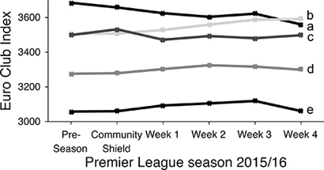
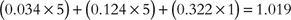
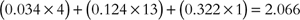
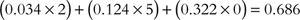
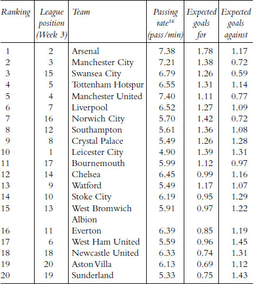

布鲁姆斯伯里出版社（Bloomsbury）同意付钱让我写一本关于足球的书，我欣喜若狂。此前我写过一本书，但那是一本学术著作，并没有带来多少收入。我曾全职工作一年写成《群体动物行为》（Collective Animal Behaviour）。四年后，在扣除各种瑞典税款后，我收到了500英镑的版税。这相当于每工作一小时只赚了31便士，而且这笔钱还是在完稿很久之后才到账。因此，当布鲁姆斯伯里不仅承诺为我的工作支付丰厚报酬，还主动预付稿酬时，我感觉自己就像中了足球彩票一样。

既然意外获得了一笔预付款，还有什么比把它投资在我熟知的领域更好的呢？如果出版社信任我，那我就应该用这笔预付款来回报他们的信任——将我在撰写本书过程中学到的知识用于实践。是时候不再纸上谈兵，而是“拿真金白银去验证我的理论”了。让我们试着预测一些足球比赛结果，然后赚点钱吧。

## 赔率中的概率

在我开始挥霍这笔钱之前，必须先把基本概念弄清楚。我需要了解一些关于赔率、概率以及庄家如何赚钱的事实。现代赌博远非那么简单。如今有大量在线博彩公司，提供不同格式的赔率。有专门网站可以比较不同庄家的赔率，甚至还有平台允许彩民之间相互交易自己的赌注。赌博已不再是走进街角博彩店、掏出5英镑押注自己心爱球队那么简单的事了。

在英国，赔率以分数形式表示，例如3/7。这意味着，每押注7英镑，若赌中便可赢3英镑。即使对数学家来说，这也并非一目了然。当我下注时，我通常不会觉得押7英镑是理所当然的金额。我更习惯押1英镑、2英镑、5英镑、10英镑或20英镑——这些才是日常生活中常见的整数，而不是奇怪的质数。赔率3/7意味着，如果我去博彩店下注5英镑，要计算可能的利润就得算出3 × 5/7。一个等式里出现了三个质数。好吧，其实也没那么难——答案是2.14英镑——但确实需要花点时间思考一下。

当我们比较赔率时，问题变得更加棘手。3/7和5/11哪个赔率更高？要弄清楚这一点，可以把分数3/7的分子和分母都乘以11，得到(3 × 11)/(7 × 11) = 33/77；再把5/11的分子和分母都乘以7，得到(5 × 7)/(11 × 7) = 35/77。这样我们就可以直接比较了：35/77 > 33/77，所以5/11 > 3/7。5/11是更好的赔率。但并非所有人都（包括我自己）能迅速完成这类心算。英国的赔率使用数字的方式，与我们在日常生活中接触的数字习惯并不一致。

如果说英国赔率有点别扭，那么美国的赔率就简直是疯狂了。它们一开始还算合理：如果英国赔率是2/1，那么美国赔率就是+200，也就是说，如果你下注100美元并获胜，利润就是200美元。这种数量级的跳跃或许可以理解，毕竟拉斯维加斯的赌徒通常以百元为单位下注，而英国人则小心地守护着自己的5英镑赌金。但对于热门球队，赔率却突然从正数变成了负数。例如，如果英国赔率是3/7，那么美国赔率就标为−233。这并不代表热门球队获胜时你能拿到233美元（一个天真数学家可能会这么想），而是意味着，为了获得100美元的利润，你必须先下注233美元。因此，所有美国赔率的数值都大于或等于100，并在前面加上“+”或“−”号，以表明该数值是你的利润，还是你需要下注多少才能赢100美元。

在本章的大部分内容中，我会采用欧洲的赔率格式，同时使用英镑——对一位英国数学家来说，这是最简单的组合。欧洲赔率很容易理解：它告诉你，如果下注1英镑并获胜，你能拿回多少钱。如果赔率是1.5，那么赢了之后，你的1英镑就变成了1.50英镑；如果输了，这1英镑就没了。就这么简单。英国赔率3/7转换成欧洲赔率就是1 + 3/7 = 1.43。因此，如果我下注1英镑，赌中后就能拿回1.43英镑。欧洲赔率就像利率一样：要计算潜在利润，只需将下注金额乘以赔率即可。

## 何时该下注？

我以前从未真正赌过足球。从观察身边赌球的朋友来看，我的总体印象是，他们在下注时几乎不会考虑数学。比如：我和朋友约翰一起看一场欧冠比赛，马德里竞技对阵奥林匹亚科斯。开场31分钟后，马竞0比2落后。此时，马竞获胜的欧洲赔率升至7.00，这个数字在屏幕上一闪而过。“欧冠比赛总是充满意外，”约翰说，“押10英镑在马竞身上，肯定能让这个周二晚上热闹不少。”他掏出手机下了注。一个半小时后，比分定格在3比2，奥林匹亚科斯获胜。约翰损失了10英镑，但我们俩都因为他的赌注而比平时跳得更高、喊得更大声。偶尔这样不带太多思考地赌一把，确实挺有趣。

但约翰的行为完全是非理性的。他根本不知道马竞获胜的可能性有多大，也没有计算庄家认为马竞获胜的概率是多少。而且为什么是10英镑？为什么不是1英镑、100英镑、10便士，或者他年薪的10%？他知道，如果押10英镑，马竞赢了他能赚60英镑，输了就亏10英镑，但他有没有算过这笔赌注的预期盈亏是多少？庄家又能从他和其他周二晚上守在电视机前的业余彩民那里赚多少钱？这些问题他连想都没想过。但如果你真的认真对待赌博，这些问题正是你应该问自己的。

如果你从本章只记住一件事，那就应该是：**在查看赔率和下注之前，先估算你预测结果的概率**。赔率不等于概率。赔率告诉你潜在的利润，而概率则估计某一事件或结果发生的可能性。我们在谈论未来时经常会使用概率，比如“我有99%的把握他们是一对”或“明天有30%的降雨概率”。同样，在决定是否押注某队获胜时，你也应该用概率思考：“切尔西有50%的可能再次赢得联赛冠军，而莱斯特城只有1%的机会。”在掏钱之前，甚至在看赔率之前，先问问自己：“我的球队获胜的概率是多少？”

2015年社区盾杯切尔西对阵阿森纳的比赛还有三周就要开打。上赛季切尔西是英超冠军，而足总杯冠军阿森纳则急于证明自己。我认为两队实力相当，只是略微倾向切尔西。因此我预测：切尔西有55%的胜率，阿森纳45%。但90分钟内打平也是可能的。根据赛事不同，20%到30%的比赛以平局收场。我对社区盾不太了解，所以设平局概率为25%。那么90分钟内分出胜负的概率就是75%。因此，我估计切尔西在90分钟内获胜的概率为0.55 × 0.75 = 41.25%，阿森纳则是0.45 × 0.75 = 33.75%。

只有这时，我才允许自己去查看赔率。我访问了一家主流英国博彩公司的网站，看到赔率分别是：切尔西胜13/10，平局12/5，阿森纳胜21/10。换算成欧洲赔率，分别是切尔西2.3、平局3.4、阿森纳3.1。看来这家博彩公司大致认同我的判断：他们也认为切尔西比阿森纳更可能赢；而平局的赔率最高，说明他们认为平局最不可能发生。但我真正需要知道的是：在这些赔率下，我是否应该下注？如果下注，该押哪一方？

要回答这个问题，我需要计算：如果我下注1英镑，比赛结束后我预期能拿回多少钱。对于切尔西，我估计其胜率为41.25%。现在我要知道的是，在这种情况下，平均而言我能拿回多少。**这个“预期收益”才是决定押哪一方的核心**。我想知道，假设我为每种结果分配的概率是正确的，那么下注后我预期能拥有多少钱。

我们来计算押注切尔西的预期收益。如果我押1英镑在切尔西身上，那么有41.25%的概率我会在赛后拥有2.30英镑。该结果的概率乘以赔率是：0.4125 × 2.3 = 0.9487。另一方面，我估计切尔西不胜（输或平）的概率是58.75%，这种情况我会血本无归。因此，押注切尔西的总体预期收益为：**(0.4125 × 2.3) + (0.5875 × 0) = 0.9487**

结果略低于95便士，比最初的1英镑还少。所以押切尔西不是好选择。押平局更糟：类似计算显示，我的1英镑平均会变成85便士。然而，阿森纳开始看起来是个不错的选择：我发现，我的1英镑预期能增长到1.046英镑——虽小但体面的4.6%“利率”。

这里最难理解的一点是：**押阿森纳并不意味着我认为他们会赢**。我已经说过，我认为他们在90分钟内获胜的概率略高于33%，而切尔西的胜率超过40%。所以即使基于我自己的判断，押阿森纳也很可能输。这一点很难接受。我们都希望向朋友吹嘘自己“猜中了赢家”。但如果你理性赌博，你押中的输家和赢家数量应该差不多。赌博的诀窍不在于“猜中赢家”，而在于**最大化预期利润**。这个预期收益的计算方式如上所述：将每种结果的概率乘以其对应的回报金额。

这里有一个简单的通用数学法则来决定是否下注：如果你估计某队获胜的概率为 *p*，而欧洲赔率为 *o*，那么只要满足以下条件，就应下注： *p* > 1/*o* 

用手机计算器做这个计算只需一秒钟，下注前你应始终这样做。先估算你对某一结果的概率判断，然后访问博彩公司网站查看赔率。在计算器上按“1”、“÷”、输入赔率、按“=”；如果得出的数字小于你的概率估计，那就下注；否则，再三思。这个检查能帮你避免很多愚蠢的错误。

以阿森纳为例，*p* = 0.338，1/*o* = 0.323。1/*o* 小于 *p*，因此条件成立。而对平局和切尔西胜，条件不成立。所以，2015年7月，我押了1英镑在阿森纳身上，正式踏入了赌博世界。三周后，我赚了2.10英镑。

## 我需要多准才能赢？

赢钱当然令人鼓舞，但我必须提醒自己：我只是运气好而已。我当时认为切尔西会赢，庄家也这么认为。我之所以押阿森纳，仅仅是因为赔率更有利。现在我得认真想想自己面对的是什么。庄家设定的赔率基于所有彩民的下注行为。如果“群体智慧”（Wisdom of Crowds）理论在此适用，那么我们应该预期庄家提供的赔率能反映球队胜负平的真实概率。上一章我已展示，庄家能如何迅速调整赔率以反映群体的预测。不仅如此，他们在预测足球比赛结果方面也比我有丰富得多的经验。即使群体判断略有偏差，庄家的初始赔率也是基于多年经验设定的。要想赢钱，我必须比庄家和成千上万彩民的集体知识做得更好。

那么，假设庄家赔率完美反映了各种结果的真实概率。再假设庄家的赔率也反映了各结果的下注人数。以那场社区盾比赛为例：如果切尔西胜的赔率是2.3，则其获胜概率就是1/2.3 = 43.5%；阿森纳胜的概率是1/3.1 = 32.2%；平局概率是1/3.4 = 29.4%。但这里有个问题：43.5% + 32.2% + 29.4% = 105.1%！总概率不能超过100%，这显然不合理。

概率总和超过100%的原因在于赔率并不“公平”。那多出的5.1%就是庄家的优势。要获得真实概率，我们需要对这一利润进行修正，即把各项除以105.1。因此，庄家对切尔西胜的真实概率估计是43.5/105.1 ≈ 41.3%，阿森纳胜为32.2/105.1 ≈ 30.7%，平局为29.4/105.1 ≈ 28.0%。现在三者加起来正好是100%。如果群体足够聪明、庄家完全高效，这些就是各结果的真实概率。

如果赔率完美反映现实，那么无论你押哪一方，预期利润都是一样的。如果我在社区盾押1英镑在阿森纳身上，预期回报是0.307 × 3.1 = 0.95英镑（95便士）。押切尔西也一样：0.413 × 2.3 = 0.95英镑；押平局也是95便士。平均而言，庄家每收我1英镑，就会赚走约5便士。

大多数在线博彩公司的赔率中都内置了5%到6%的优势。你可以用上述方法计算任意赔率的庄家优势：取欧洲格式的胜、平、负赔率，分别求倒数得到概率，再求和；总和超出100%的部分就是庄家的“不公平”程度——这也告诉你，你必须比这高出多少才能赢钱。

你其实可以改善自己的赔率。不同庄家对同一场比赛的报价可能不同。虽然每家庄家都有内置优势，但有些对热门球队开更高赔率，有些则对冷门更慷慨。例如，在2015/16赛季第三轮周末，一家主流博彩公司对纽卡斯尔客场战胜曼联的赔率是10.00，而其主要竞争对手只给9.00。选择前者下注，预期利润可提高11%；但对手对曼联胜的赔率是1.33，而前者只有1.28，因此押曼联时选择对手可多赚4%。

只在一个庄家开户，坦白说，是愚蠢的。即使只使用四家不同的庄家，你也能发现赔率上的显著差异。我注册了四家主流博彩公司，并通过比价网站比较赔率。通过选择最优赔率，庄家的优势从5%~6%降到了约1%~2%，有时甚至低至0.01%。庄家彼此竞争，会通过在不同结果上提供更低（更有利）的赔率来吸引客户。货比三家，确实能找到更好的下注机会。

1%~2%的劣势看似微小，但它适用于每一笔赌注。如果我下注10英镑、庄家优势为2%，那么这笔赌注的预期回报是9.80英镑；第二笔后预期为9.60英镑；十笔之后只剩8.17英镑；如果每周下注一次，一年后我预期只剩下3.50英镑。这已经很糟了，但如果只用一家庄家（优势6%），一年后我的10英镑会缩水到仅剩40便士。其他9.60英镑都进了庄家口袋。难怪庄家会用“免费自选”和“开户送100英镑”来吸引客户——这些优惠一旦你开始下注，很快就会消失。

## 挑战

2015/16英超赛季即将开始，我的目标是在前五个比赛周通过下注赚钱。我的预算是500英镑，再加上之前因阿森纳赢得社区盾而赚到的2.10英镑，总共502.10英镑。我给自己设了几条规则。

第一条：我将使用数学下注策略。虽然我看球时自然会形成谁表现好、谁状态佳的主观看法，但在本次下注实验期间，我会把这些看法搁置一边。我会提前基于比赛数据和庄家赔率建立模型，并用这些模型做预测。这些模型在下注期开始前就已设定好，虽然会稍作调整，但我会始终遵守。

第二条：所有模型都从零开始搭建，使用的数学和统计方法来自本科阶段的经济学、物理学和工程学课程。我得到了专业赔率公司OddsCraft的罗宾·雅各布森（Robin Jakobsson）在理解赔率和比赛概率方面的帮助，但所有模型都是我自己用Matlab编程完成的，耗时约三到四周。

第三条：模型所用数据全部来自公开网络资源。网上有大量比赛数据，从射门统计到球队排名指数，还有众多赔率比价网站提供历史记录。我只使用这些公开数据作为模型输入，绝不使用俱乐部或公司内部的私有数据。

最后一条主要是对自己说的：**享受过程**。能靠写这本书赚钱已是非常幸运，无论输赢，我都要享受用这笔钱进行实验的过程。

## 策略一：强队热门，势均平局

庄家赔率在多大程度上能预测比赛结果？正如第十一章所述，如果群体是智慧的，我们应预期赔率能准确反映结果。但我们也看到，群体可能因计算错误或谣言传播而被情绪裹挟。为了测试2014/15赛季英超博彩群体的表现，我下载该赛季所有比赛的最终赔率，并与实际结果直接对比。

先看那些主胜欧洲赔率接近2.00的比赛——这意味着若主队获胜，赌注几乎翻倍。当庄家开出2.00的赔率时，暗示他们预测主队约有一半概率获胜。2014/15赛季英超共有35场比赛的主胜赔率在1.90到2.10之间。例如：利物浦对埃弗顿（1比1平）、西布朗对伯恩利（4比0）、曼城对曼联（1比0）、桑德兰对赫尔城（1比3）。这些比赛通常主队排名略高于客队，赔率略微倾向主胜。

对于2.0的赔率，庄家预测的主胜率是50%。在35场比赛中，我们预期约有17.5场主胜。实际上有19场——非常接近预期，完全在统计误差范围内。在这些比赛中，庄家赔率对主胜的预测相当准确。

但庄家并非总是如此精准。再看主胜赔率在1.33到1.43之间的比赛。这类赔率常见于欧冠级别强队对阵积分榜下游球队。2014/15赛季，曼联主场对阵桑德兰、水晶宫和纽卡斯尔的比赛赔率就落在这个区间（他们赢了前两场，但输给了西布朗）。1.33到1.43的赔率意味着庄家预测主胜概率在70%到75%之间。实际上，在28场此类比赛中，有25场主队获胜，胜率达89%——**庄家严重低估了热门强队的胜率**。

为了判断这是否构成整体趋势，我们需要找出赔率所隐含概率与实际胜率之间的统计关系。图12.1展示了2014/15赛季全部380场比赛的数据，将主胜赔率相近的比赛分组比较。赔率在1.9到2.1之间的点非常接近对角线，因为如前所述，这些赔率预测准确。而赔率在1.33到1.43之间的点明显位于对角线上方，说明庄家低估了主胜比例。

图12.1：2014/15英超赛季庄家赔率隐含概率与实际比赛结果的对比。黑点位于虚线上方，表示主胜实际发生频率高于赔率预测；位于下方则表示低于预测。空心圆圈标出文中详细讨论的赔率组合。

观察图12.1，很难判断是否存在整体上低估强队的趋势。有些点在对角线上方，有些在下方。但通过一种名为**逻辑回归**（logistic regression）的统计方法，我可以找到预测与结果之间的最佳拟合关系。这种拟合揭示了庄家赔率中的一个微小偏差：**主胜的实际比例随赔率变化的速度，比庄家预测的更快**。

不过我得谨慎些。这一趋势在2014/15赛季英超数据中并不具有统计显著性，但它与早先经济学和管理学领域的学术研究一致。多项研究考察了足球、美式足球、赛马等运动的博彩行为，发现彩民普遍偏好押注冷门（long shots）。从心理学角度看，这很容易理解：押5英镑赌切尔西1.30击败伯恩利，只能赢1.50英镑，远不如押伯恩利11.00、梦想赢50英镑来得刺激。对大多数人来说，赌博需要悬念和偶尔的意外之财。但对我们的数学模型而言，**底线才是关键**。既有研究结合上述分析，支持了“押注热门”的策略。

庄家赔率中还有另一种可能被利用的模式：在两支实力相当的球队交锋时，**平局的发生频率远高于强弱分明的比赛**。2014/15赛季，曼城对切尔西、桑德兰对斯托克、利物浦对阿森纳、QPR对斯旺西都以平局告终。在这些比赛中，庄家对两队胜率的预测差值小于5个百分点。例如，利物浦主场对阿森纳一役，庄家给利物浦34.5%的胜率，阿森纳37.7%，差值仅3.2个百分点，平局概率则为1 − 0.345 − 0.377 = 27.8%。那场比赛最终2比2平。

我统计了2014/15赛季72场两队胜率差小于10个百分点的比赛，其中25场打平，平局概率达34.7%。而庄家对这些比赛的平均平局概率仅为29.5%。**赔率系统性地低估了势均力敌比赛中的平局可能性**，而更倾向于某一方获胜。同样，这一差异虽无强统计显著性，但值得考虑——可能正如彩民不爱押热门一样，他们也不愿赌势均力敌的平局。

尽管不具强显著性，但对“强队热门”和“势均平局”的低估，是我在上赛季赔率中发现的最清晰模式。这构成了我将尝试的策略——我称之为“赔率偏差策略”：对每场比赛，先计算庄家给出的两队胜率之差；若差值大于0.4，则押注热门；若差值小于0.15，则押平局。

## 策略二：结果指数

欧洲俱乐部指数（Euro Club Index）采用一种（前一章详述过的）基于比赛结果在俱乐部间转移积分的系统。该指数完全基于胜负结果计算：胜则加分，负则减分。这正是其优势所在。正如彩民偏爱冷门、回避势均平局一样，我们也倾向于看到并不存在的短期模式。多项关于篮球和美式足球的研究都发现了“热手效应”（hot hand effect）——彩民倾向于押注近期连胜的球队，认为其势头会延续。尽管“热手效应”的强弱尚有争议，且过去30年广泛讨论后已有大量彩民刻意反其道而行，但人性使然，我们仍会过度反应于短期状态变化。如果欧洲俱乐部指数真能反映长期趋势，它就应能击败赔率市场。

欧洲俱乐部指数确实会变化，但很缓慢。图12.2展示了2015/16赛季英超前四周排名前五的球队指数变化。切尔西因三负一平一胜的糟糕开局而下滑，但即便如此，在第三周他们仍是英格兰排名最高的球队。当周他们客场对阵西布朗，欧洲俱乐部指数给出63%的胜率，而庄家最优赔率对应的胜率是60%。而开局连胜的曼城，欧洲俱乐部指数对其客场对阵埃弗顿的胜率预测为46%，庄家则给到56%。可见，**博彩市场比指数更快地对赛季初结果做出反应**。

切尔西和曼城在第三周都赢了球，但第四周切尔西主场惨败于水晶宫后，两队排名互换。仅凭这些观察尚不足以判断欧洲俱乐部指数与博彩市场孰优孰劣。但可以看出，**欧洲俱乐部指数比博彩市场更“谨慎”**。如果该指数运作良好，而博彩市场对结果反应过度，那么跟随指数应能盈利。我将欧洲俱乐部指数作为我的第二项下注策略。

图12.2：2015/16赛季开局前四周欧洲俱乐部指数排名前五的球队。切尔西（a）排名下滑，曼城（b）上升。阿森纳（c）、曼联（d）和利物浦（e）变化较小。

## 策略三：表现指标

职业赌徒通常试图找到别人忽略的球队表现指标。我们都能看到球队进了多少球、赢了几场，但如果一个赌徒能找到预测未来表现而别人没注意到的指标，他就有了优势。赌徒们往往对其有效指标讳莫如深，所以我得自己找几个。

我们在电视上最常看到的表现指标是控球率：每支球队控球时间的百分比。当心爱球队0比1落后但控球更多时，我们很容易觉得他们即将扳平。直播博彩网站会显示控球数据，然后为逆转开出高赔率，诱使你相信控球等于表现更好，进而押注控球方。**别上当**。控球并不保证球队踢得好。当两支实力相当的球队交锋时，控球率与进球率并无关联。实际上，近年英超数据显示，控球更多的球队反而更可能输球——因为落后一方急于进攻，而对手则乐意让出控球权，等待其犯错。落后导致更多控球，但更多控球并不必然带来进球。

博彩网站和电视还会提供另一项指标：射门次数（包括射正与射偏）。射门比控球更能预测结果，但仍只是故事的一小部分。一记禁区外的投机射门，即使射正，进球概率也远低于一次禁区内的精控射门。要真正了解球队的得分能力，我们需要知道射门的位置。

通过将球场划分为若干区域并统计各区射门的进球概率，可以轻松建立一个“进球来源”模型。例如，可将球门区（也即小禁区）、禁区（不含球门区）和禁区外定义为三个区域。统计过去几个赛季的数据，从这三个区域射门的进球概率分别为32.2%、12.4%和3.4%。

最后一个数据让我很惊讶。在看到这些数字前，我看球时总会在前锋逼近禁区时站起来大喊“射门！”——现在不会了。3.4%的成功率相当 sobering（发人深省）：平均而言，禁区外需要近30次射门才能进一球。如果前锋能再往前推进几米，进球概率就能翻三倍。

从FourFourTwo的Statszone在线版中获取过往比赛的射门位置数据很简单。我只需统计各区域射门次数，并按进球概率加权。例如，2015年8月水晶宫主场对阵阿森纳的比赛，水晶宫在禁区外射门5次，禁区内（球门区外）5次，球门区内仅1次。根据这些射门，预期进球数为：

这与水晶宫实际进的1球（来自禁区外）非常接近。阿森纳的预期进球数也与其实际打进的2球相符：他们禁区外射门4次，禁区内（球门区外）13次，球门区内1次，预期进球为：

阿森纳尤其有趣，似乎温格（Arsène Wenger）早已看过我列出的射门成功率数据。他们几乎从不浪费机会，总是设法把球带入禁区再射门。

一周前主场0比2负于西汉姆的比赛中，阿森纳的预期进球为：

与对水晶宫时几乎相同。而西汉姆的预期进球仅为：

但西汉姆7次射门中有2次进了。这场比赛正好说明了“预期进球”为何对赌博有用：**阿森纳对西汉姆是运气差，但对水晶宫时进球反映了真实机会；西汉姆则是运气好，下一轮主场就输给了莱斯特城**。预期进球比实际进球更能预测未来表现。

另一项重要表现指标是传球效率——每分钟控球时间内的成功传球次数。传球越多，进球可能性越大。而且，无论此前比赛胜负如何，**过去成功传球多的球队更可能赢下下一场比赛**。关键不在于你控球多久，而在于你如何传导球。

下一步就是数据处理。为构建表现指标模型，我采用各队此前比赛的预期进球和传球效率，用以预测后续比赛的进球率。通过泊松回归（Poisson regression）技术，我发现预期进球和传球效率都是比过往战绩更优的进球率预测指标。这正是一个优秀表现指标模型的核心要求：**大众关注的过往战绩，在预测结果方面不如这些表现指标**。

表12.1列出了2015/16赛季英超第四周前各队的传球效率及攻防预期进球均值。球队排名根据这些统计数据计算得出：传球效率和预期进球越高，排名越高。

表12.1：2015/16赛季英超第四周前基于传球效率和预期进球的球队排名。

该排名计算后的当周有几场引人注目的比赛。两支豪门切尔西和曼联对阵排名更高的弱旅，结果双双落败：排名第12的切尔西主场负于第9的水晶宫；排名第5的曼联客场输给第3的斯旺西。若根据该排名在第四周下注，投资回报可达四倍：赛前周五水晶宫胜赔率达11.00，斯旺西为3.60。当然，不能仅凭一两场比赛下结论，但这足以表明表现指标确实有用。**传球效率和预期进球构成我的第三项策略**。

## 策略四：专家意见

在上述三种策略中，我试图利用彩民评估足球时的偏差来击败赔率。我识别了赔率、长期战绩和表现指标中的统计模式——这些很可能是大多数人忽略的。但统计并非万能。球场上许多事情无法用传球效率、预期进球或排名捕捉，而我们期待足球专家能察觉这些。

我决定押注的专家是乔·普林斯-赖特（Joe Prince-Wright）——NBC体育ProSoccerTalk的主编兼首席撰稿人。他生活在伦敦，呼吸着英超的空气，每天向美国发送新闻和报道。他在推特上点评每场重要比赛的每个细节，似乎从未错过任何一脚传球。他每天为NBC撰写多达20篇文章，覆盖从顶级联赛到低级别联赛的方方面面，传递转会传闻和伤停消息。由于供职于（足球报道方面）相对较小的媒体，普林斯-赖特必须亲自核实事实，确保内容准确。这或许能解释为何（如上一章所示）他在预测2013/14和2014/15赛季英超结果时表现出色。谈到英超，此人确实懂行。

普林斯-赖特还敢于预测未来。除了给出整个赛季的预测外，他每周还会发布“英超精选”（Premier League picks）。他为下周每场比赛给出确切比分预测，例如“阿斯顿维拉0比2曼联”或“斯旺西3比0纽卡斯尔”。他并不指望我们照单全收，而是会用“基本上，白送钱”、“所以你是说还有机会？”或“千万别碰”等语句表明自己的信心程度。但这些比分确实透露了他认为谁会赢、赢多少。

为将普林斯-赖特的比分转化为我所需的概率预测（以便与庄家赔率比较），我将其转换为“预期进球率”。我认为他有时会略微夸大进球数以强调两队实力差距，因此我会对此进行调整。例如，他预测维拉0比2负于曼联。实际上，维拉仍有进球可能，所以我将其预期进球设为0.5；而曼联的2球预期偏高，我将其下调至1.5。一般而言，将普林斯-赖特预测进球 *P* 转换为进球率 *S* 的公式为：

这便构成了我的第四项——专家策略。

## 策略五：问我妻子

在解决人生难题时，有一个人的意见我比任何人都更看重。无论是小事（比如我钥匙放哪儿了），还是大事（比如如何养育孩子），我都信赖洛维莎·桑普特（Lovisa Sumpter）的判断。她不仅是我出色的妻子，还是一位数学教育副教授和认证瑜伽教练。因此，在理清思路和平衡生活方面，洛维莎非常在行。

洛维莎还有另一项才能：她是**我认识的唯一一位赢过足球彩票的人**。在我们相识之前，她还是学生时，就曾正确预测了瑞典足球彩票（Stryktipset）全部13场比赛的结果。随机猜中全部13场的概率是1/3^13 = 1/1,594,323。可惜那周比赛似乎比平常更可预测，还有不少人也全猜对了。洛维莎分享了头奖，拿到约600英镑。对学生来说已很不错，但若她是唯一中奖者，本可赢得环球旅行或买房的巨款。洛维莎后来不再追踪足球形势和玩彩票，但她仍为自己是瑞典少数“猜中全部13场”的人之一而自豪。

基于此，我提出第五项、也是最后一项策略：“问我妻子”。她将代表典型的彩民。

## 综合所有策略

现在我有了五项策略，而每场比赛都有三种可能结果。这是个问题：如果策略意见不一，我可能会对同一场比赛同时押注主胜、客胜和平局。考虑到庄家的内置优势，这显然不明智。

解决方案是：将每项策略转化为结果概率，然后综合得出每场比赛胜、负、平的总体概率。赔率偏差策略（策略一）已基于比赛概率，可直接转换；欧洲俱乐部指数（策略二）也已输出各结果概率；表现指标策略（策略三）和专家策略（策略四）都给出双方的进球率。例如，根据普林斯-赖特的预测，我设维拉进球率为0.5，曼联为1.5。然后我用这些数据进行泊松模拟（如第一章所述），得出维拉对曼联一役的概率：主胜12.5%、平局23.0%、客胜64.5%。表现指标策略也以同样方式通过泊松模拟得出概率。

我的四项下注策略经常给出截然不同的预测。例如第四周切尔西对西布朗一役，赔率偏差策略建议押切尔西胜，而表现指标策略更看好西布朗。为调和矛盾，我取四项策略的平均预测，并通过 *p* > 1/*o* 检验与庄家赔率比较。只有当某结果通过检验时我才下注。在切尔西对西布朗一役中，表现指标对客胜的概率评估压倒了赔率偏差策略，我的综合模型最终支持押注西布朗。

最后但同样重要的是“问我妻子”策略。洛维莎知道，我重视她的判断，与我是否听她的话是两回事——我太固执了。因此，她不会参与我的赌博决策。我会从我们共有的储蓄账户（我存入了布鲁姆斯伯里预付款）中取出100英镑交给洛维莎，由她按自己的策略随意下注。剩下的402.10英镑则由我用于上述四项策略。让我们看看谁的表现更好。