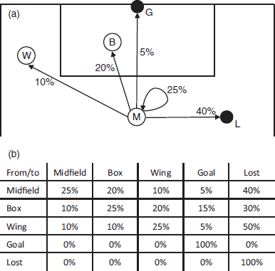

大约在《足球数学》（*Soccermatics*）第一版出版之际，足球界正经历一场革命。利用网上公开的比赛数据，业余分析师们纷纷在推特和博客上发布自己对球员和比赛的统计与数学分析。这些业余爱好者开始做专业人士本应早在多年前就该做的事——通过传球网络、射门数据和战术地图来分析比赛。

俱乐部开始注意到这股趋势。2012年，阿森纳收购了表现分析公司StatDNA，如今已将其服务全面用于足球运营¹。在2015–16赛季赢得联赛冠军的过程中，莱斯特城一线队的分析师使用Opta数据辅助主教练进行赛后简报²。数据也被管理者用来佐证自己的观点：曼联主帅路易斯·范加尔曾在新闻发布会上挥舞一份Prozone打印件，以证明自己的球队并未打“长传冲吊”足球³。统计数据甚至进入了董事会：《数字游戏》（*The Numbers Game*）一书的作者克里斯·安德森被任命为考文垂市足球俱乐部的董事总经理。这些俱乐部与曼城、拜仁慕尼黑和利物浦一道，将数学融入了比赛。

然而，在线数据革命也遭遇反对者。2015年夏天，阿斯顿维拉出售或放走了三名最佳球员：克里斯蒂安·本特克、法比安·德尔夫和汤姆·克里维利。他们从欧洲各地引进了13名新球员，其中许多是基于球探部门的统计推荐。然而这一策略惨遭失败。球队一路滑落至积分榜垫底，最终耻辱降级，主教练蒂姆·舍伍德也在11月初被解雇。

舍伍德将自己被解雇归咎于维拉对数据的依赖。“所有这些数据分析或许有用，但绝不能用来挑选球员，”他告诉《每日电讯报》。“有些数据跟进球或助攻无关，而是关于‘预期进球’——即球员处于可能得分的位置但并未破门。这简直是胡说八道。”⁴ 这是对俱乐部内部和业余分析师广泛采用的方法的严厉批判⁵。

但舍伍德的抵制是徒劳的，这场革命无法被阻止。我亲历了这一进程。在我完成《足球数学》写作之后，我受邀为《FourFourTwo》网站撰写专栏，使用我开发的工具制作战术地图，分析近期比赛。我还开始与多家顶级俱乐部会面，讨论他们如何更好地利用数据。通过推特，我结识了大量博主和业余分析师，他们乐于分享经验，并就不同分析技术提供建议。在2015–16赛季期间，我亲眼看到这些业余爱好者——其中许多人比他们所分析的球员还要年轻——一个接一个地进入俱乐部和咨询公司任职。职业足球界急需数据专家，而他们最终在互联网上找到了大量人选。

## 开始写作

21世纪俱乐部（21st Club）足球情报主管奥马尔·乔杜里（Omar Chaudhuri）向我分享了进入足球行业的建议：“开始写作！我的博客实际上就是我的简历。没有它，我连一次面试机会都拿不到，更别说获得工作了。”

奥马尔2011年还在读大学时就开始写博客，因为对媒体中缺乏对足球的深度分析感到沮丧。他的博客帮助他获得了一份实习机会，与伊恩·格雷厄姆（Ian Graham）共事，后者后来成为利物浦研究主管。之后，奥马尔成为Prozone首位数据科学家。几年后，他加入21世纪俱乐部，与阿森纳、热刺、南安普顿、水晶宫和埃弗顿，以及挪威、荷兰和美国的俱乐部合作。从学生宿舍到英超董事会，奥马尔只用了不到三年时间。

奥马尔认为，真正影响足球俱乐部决策的最佳途径是通过董事会。他告诉我：“与教练、助教和球员合作的问题在于，由于他们的任期太短，总是聚焦于下一场比赛。”而对拥有长期投入的董事会而言，基于事实制定计划至关重要。奥马尔的角色就像是董事会里的“谣言拆解者”。足球界充斥着各种神话，他的任务就是通过统计和逻辑分析检验哪些站得住脚。

奥马尔已证明许多神话是错误或误导性的。“希望从英冠升级的球队应雇用有该联赛经验的球员”——数据并不支持这一说法。“主教练应让球队踢得更具侵略性”——这种说法无法量化、毫无意义。“英超球队的工资总额决定成绩”——这只适用于“Big Six”（六大豪门）与其余球队之间的差距。非六大豪门球队完全可以在较小预算下取得佳绩。“西班牙和巴塞罗那的成功意味着俱乐部应寻找身材更矮小的球员”——研究并未证实这一点。相反，球队可能陷入盲目追随潮流的风险。一个接一个的足球神话在奥马尔的统计检验下土崩瓦解。

另一个常见误区是：球员的转会费直接反映其足球能力。虽然顶级球员确实更贵，但实际支付的价格往往比能力与价格的简单对应关系复杂得多。在我与奥马尔交谈时，保罗·博格巴刚刚以创世界纪录的8900万英镑加盟曼联。奥马尔告诉我：“博格巴的确花了曼联一大笔钱，但曼联也是全球收入最高的俱乐部，拥有庞大的球迷期待，并且急需一名中前卫。把这些因素加起来，这笔支出对曼联来说或许是有道理的。但对其他俱乐部而言，情况未必如此明确。”

只要和当地公园里的几个孩子聊聊，你就能理解奥马尔的观点。我指导的每个年轻球员都模仿博格巴的“Dab”庆祝动作，都渴望在新版本的《FIFA 17》中扮演他。博格巴的确是一名出色的球员，但就像加雷斯·贝尔、C罗和贝克汉姆一样，他也是一名极具市场价值的商品。奥马尔的工作就是提醒其他俱乐部警惕盲目跟风的风险，因为顶级球员的价格正在呈指数级增长。俱乐部的转会策略应着眼于长期成功，而非追逐头条新闻中的潮流。

## A排：恩戈洛·坎特

在2014–15赛季，恩戈洛·坎特在整个欧洲联赛中每场成功抢断次数排名第一。当时他效力于法甲球队卡昂⁶。派球探考察他几乎是理所当然的事，许多俱乐部确实这么做了。但莱斯特城的史蒂夫·沃尔什（Steve Walsh）最为坚持，极力向主教练推荐签下坎特。莱斯特城以据报560万英镑的价格签下他，夺得英超冠军，次年便以3200万英镑将他卖给切尔西。这个抢断数据很简单，但它没有说谎。

一位我交谈过的分析师将这种做法称为“电子表格球探”（spreadsheet scouting）。球探们拥有庞大的电子表格，列包括抢断、拦截、传球和盘带等数据。他们按自己最关注的列进行排序。A排显示最佳球员，B排是第二名，依此类推。他们正是从这里开始搜寻。当史蒂夫·沃尔什转任埃弗顿足球总监后，他签下了自己表格中的B排球员——阿斯顿维拉的伊德里萨·盖耶（Idrissa Gueye）。和坎特一样，盖耶也在2015年从法国加盟英超，首个赛季在抢断和拦截榜上仅次于坎特。

不过，球队并非仅靠电子表格买人。所有职业球探都认同，在签约前亲眼观看球员比赛至关重要。比赛录像很有价值，但坐在场边观察球员如何对场上局势做出反应、如何与队友互动，是无可替代的。一次全面的评估通常需要观看球员多场比赛，如有可能，还需与球员交谈并观看其训练。

俱乐部真正的问题在于如何在初始的统计筛选、球探网络、视频分析、现场观赛以及用数据复核决策之间取得良好平衡。

阿斯顿维拉与莱斯特城在2015–16赛季的截然不同结局，完美诠释了这一点。两队都采用了以统计数据启动搜寻的原则，都在2014–15赛季从法国联赛中发掘了被低估的球员。莱斯特城签下了坎特和里亚德·马赫雷斯（Riyad Mahrez），历史上首次赢得英超冠军。维拉则签下了盖耶和其他三名法甲球员，却以队史最低积分惨遭降级。

两队最大的区别似乎在于教练组与分析师之间的相互信任。莱斯特城已将统计数据融入运营的方方面面，而阿斯顿维拉的球探团队与主教练蒂姆·舍伍德却无法就如何使用统计数据达成共识。

当我与西汉姆联的技术球探兼分析师罗里·坎贝尔（Rory Campbell）交谈时，他强调俱乐部需要一套涵盖所有球员评估环节的、以分析驱动的全盘战略：从统计分析，到对球员个性和态度的理解，再到实地观察球员的优缺点。罗里自身的背景正是这种融合的典范。他少年时曾效力阿森纳青训至16岁，之后进入牛津大学，白天学习哲学、政治和经济学，晚上则是一名成功的高额扑克玩家。大学毕业后，他考取教练执照，从执教母校中学队起步，逐步在巴尼特和卡迪夫城获得职位。

这些经历使罗里懂得如何在决策中融合足球、数据分析和心理学。“无论是扑克、经济学、博彩还是足球，关键都是在压力下利用所有信息做出正确决策，”他告诉我。

来自顶尖大学的毕业生正越来越多地进入俱乐部任职。亨利·纽曼（Henry Newman）在伦敦政治经济学院学习哲学与经济学。求学期间，他利用课余时间尽可能学习足球知识，跟随教练见习，并考取了所有教练资格。此后，他在巴尼特、查尔顿、布伦特福德和西汉姆联担任一线队和青训相关职务。他告诉我：“我不能说直接把学术知识应用到足球中，但它塑造了我对待比赛的一切方式。”

罗里和亨利将分析性思维方式带入了他们服务的俱乐部。但正是他们对足球各方面的全面经验，使他们能有效应用这种思维。

罗里认为，许多俱乐部在真正利用数据方面还有很长路要走。“有些俱乐部的引援流程完全搞反了，”他告诉我。“引援常常由经纪人发起，俱乐部只是被动反应。经纪人固然重要，但俱乐部应内部主动识别球员。”

太常见的情况是，经纪人向俱乐部推荐有意加盟的球员，然后数据分析师、视频分析师、教练、主教练和主席就该球员的优劣展开讨论。在西汉姆联，罗里希望采取更主动的策略：俱乐部应先确定自己的比赛风格，再围绕这一长期战略搭建球探体系。为此，他正在开发算法，自动识别符合俱乐部长期目标的候选球员。通过用足球语言与球探和经纪人讨论分析结果，他期望围绕这些球员达成一种既基于数据又结合传统方法的共识。

## 数学球

当我与英超俱乐部的分析师和球探交谈时，他们经常提到《点球成金》（*Moneyball*）这本书和电影——讲述比利·比恩（Billy Beane）如何利用数据指标带领奥克兰运动家棒球队取得意外成功的故事。坎特的故事表明，类似“点球成金”的方法或许也能帮助足球发掘隐藏人才，就像十多年前在棒球界那样。

然而，统计数据也有其局限性。足球顾问、Statsbomb网站创始人泰德·努特森（Ted Knutson）谨慎地界定了统计数据能做什么、不能做什么。他开发了“球员雷达图”（player radars），以更直观的格式展示各类统计数据。评估前锋时使用的指标包括成功盘带、助攻、被抢断次数、射门和进球；评估后卫时则包括抢断、长传、封堵、争顶成功和拦截。雷达图能整体呈现球员最擅长执行哪些动作。

但泰德并未将雷达图吹嘘为解决所有球探问题的万能工具。他警告说：“它所代表的，只是统计产出。”⁸ 这些统计数据会因球员所处联赛、效力球队或所踢位置不同而变化。我们也应预期球员随年龄增长，数据会发生变化。泰德写道：“和任何工具一样，【球员雷达图】有其优缺点。总体而言，我发现有【统计】信息比没有时更容易评估球员。”

为说明这一点，泰德深入分析了坎特“榜首”的拦截数据⁹。莱斯特城在2015–16赛季的控球率低于其他球队。他们的策略是：允许对手控球，只要对方不靠近本方球门，就迅速夺回球权并发动反击。因此，尽管坎特在英超拦截榜上排名第一，但当泰德将拦截数据按莱斯特城控球时间进行调整后，这一数字下降了。坎特之所以看起来如此出色，部分原因在于他所效力的球队战术正是围绕拦截与反击构建的。

足球永远不会成为“点球成金”。棒球是球员统计的运动：一垒安打、二垒安打、三垒安打；打点、本垒打；自责分率、三振数。而足球是团队模式的运动：三角传递、战术、传球网络、防守协同，以及团队大于个体之和。单纯的传球次数、抢断次数或传球成功率等简单数据，无法全面评估球员的有效性¹⁰。一名频繁抢断的球员，或许恰恰是因为站位不佳；一名传球成功率高的球员，可能总是选择最安全的传球路线。

一些现场球探认为这些问题无法克服。他们未必用上文所述的术语表达，批评也往往更直接，但观点一致：统计数据无法真实反映足球比赛。我则更乐观。随着我们逐步掌握足球背后的数学原理，我们将能够创建模型、绘制战术地图，从而考虑球员间的互动关系。

目前俱乐部最广泛采用的模型是“预期进球”（expected goals，xG）——这一概念曾遭蒂姆·舍伍德极力嘲讽。在第十二章，我基于三个射门区域构建了一个简单的预期进球模型：禁区外射门进球概率为3.4%，禁区内为12.4%，小禁区（六码区）内为32.2%。俱乐部使用的模型更为复杂：会使用射门的x、y坐标，判断射门是否来自传中或直塞，是否为头球、凌空抽射或控球后射门等。每家俱乐部都有自己的预期进球计算方式，但基本方法相同：利用过往类似情境下的射门数据，建立统计模型，估算特定射门转化为进球的概率。一场比赛中球队的预期进球值，即是该场比赛所有射门机会概率的总和¹¹。

舍伍德嘲笑预期进球，因为它会给未进球的射门也赋予价值。但他误解了重点。预期进球衡量的是球队是否创造出高质量机会。显然，长期来看，那些从更好位置射门更多的球队，表现会优于那些从远处频繁射门的球队。统计数据也支持这一观察：过去预期进球更高的球队，未来更有可能赢得比赛。预期进球只是衡量机会质量的一种方式，任何希望深入了解球队表现的主教练都应关注这一指标。

颇具讽刺意味的是，最早为英超俱乐部构建预期进球模型的人之一，如今正为解雇舍伍德的阿斯顿维拉工作。山姆·格林（Sam Green）在布里斯托尔大学学习数学与物理，求学期间便开始将数学和统计物理知识应用于板球和足球分析。在博彩行业工作一段时间后，体育数据公司Opta聘用了他。

阅读山姆在Opta任职期间所做分析，显然他充分利用了公司庞大的数据集。他在2013年撰写的一篇关于曼联射门转化率的文章尤为深刻¹²。在弗格森执教的最后几个赛季，曼联的射门次数少于争冠对手，但进球转化率更高。通过“预期进球”分析，山姆指出曼联进球更多，是因为他们的射门更集中于中路——这些位置进球概率更高。但他也指出，即便考虑射门位置优势，他们的成功也难以持续。

山姆的预测被证实准确。在新帅大卫·莫耶斯（David Moyes）执教的下一个赛季，曼联的射门转化率急剧下降，最终仅排名英超第七。对于关注曼联“底层数据”的分析师而言，这一转变并不意外。

当我与山姆交谈时，他强调自己在维拉担任研究主管的工作不仅限于计算预期进球。他正在构建一个系统，整合来自球探和统计数据的所有球探信息。现场观看比赛的球探仍是俱乐部的重要信息来源，他希望确保所有球探报告都能与统计分析结合，从而对潜在引援形成完整画像。再次可见，业内从业者普遍认识到的挑战，正是将预期进球等模型与传统知识有效整合。

我问山姆，为一支刚降级的俱乐部工作、尤其前主教练还在采访中抱怨他开发的方法，是否存在风险。“有风险，”他告诉我，“但我有一份很棒的工作。我用有趣的数学研究足球……”他停顿了一下，微笑着说，“……而且薪酬相当优厚。”¹³

## 进球链

2011年，初创公司StatDNA向愿意尝试分析的博主发布了此前一个赛季英超联赛的比赛数据。业余分析师受邀参加一场竞赛，看谁能利用这些数据最深入地理解比赛。获胜者是足球博主兼软件工程师莎拉·拉德（Sarah Rudd）。

莎拉的研究论文和演讲在足球分析界已成为传奇¹⁴。那是足球分析的早期阶段，大多数俱乐部分析师甚至还没开始整理球员电子表格，更不用说讨论预期进球。因此，当莎拉登上哈佛大学“新英格兰体育统计研讨会”（New England Symposium on Statistics in Sports）的讲台，展示她基于马尔可夫链（Markov chains）的“足球战术分析与个人进攻产出评估框架”时，她已迈入全然未知的领域。

莎拉的模型将比赛划分为一系列“状态”，每个状态描述进攻方持球位置及防守方的布局。图14.1（a）中的简化示例将球场划分为Box（禁区）、Wing（边路）、Midfield（中场）、Goal（进球）和Lost（球权丢失）五种状态。前三种状态描述进攻方持球位置；“Goal”表示进球得分；“Lost”表示进攻方失去球权。从“Midfield”状态出发的箭头显示了到达其他状态的概率：20%概率进入“Box”，12%概率移到“Wing”，依此类推。这些概率也显示在图14.1（b）的比赛状态转移表中；表中每个条目表示从一个状态转移到另一个状态的概率¹⁵。

图14.1：进攻的马尔可夫链模型。存在三种持球状态：M表示在中场持球；W表示在边路持球；B表示在禁区内持球。另有两个特殊状态：G表示进球，L表示球权丢失，代表一次进攻的结束。（a）状态以圆圈表示。每个百分比值表示从中场持球时，下一动作被观察到的概率。（b）状态间转移概率。行代表当前状态，列代表下一状态，条目本身即为从一状态转移至另一状态的概率。进球（Goal）与球权丢失（Lost）为特殊状态，因其标志一次进攻的终结。

此处引入了“马尔可夫链”的数学概念。马尔可夫链模型假设状态间的转移仅取决于当前状态，与此前发生的事无关。因此，若进攻方在中场持球，无论此前是经过多次传递，还是球刚刚从对方禁区弹回，其进入禁区的概率都相同。这一假设在足球中并非总是成立，但作为起点是合理的。

基于马尔可夫链假设，我可以计算不同比赛状态的价值。方法是计算球最终进入球门或被对方夺走的概率。以图14.1（a）为例，我得出：球进入禁区后，25%的情况下会进球，75%会丢球；球在中场时，15%的进攻会进球，85%会丢球；球在边路时，12%的进攻会进球，88%会丢球。这些概率——禁区25%、中场15%、边路12%——即为各比赛状态的价值。

莎拉意识到，这些概率可用于为球员在进攻过程中的贡献分配“功劳”。例如，设想一名中场、一名边锋和一名前锋共同参与一次进球：边锋将球回传中场，中场直塞给前锋，前锋破门。我们该如何分配这次进球的功劳？

通常，所有功劳归于前锋（进球者）和中场（助攻者）。但这对发起进攻的边锋显然不公平。解决方法是计算每位球员提升进球概率的程度。当边锋将球传回中场时，进球概率从12%提升至15%，因此边锋获得15–12=3分；当中场送出直塞时，概率提升至25%，中场获得25–15=10分；前锋破门时，概率从25%升至100%，获得100–25=75分。

这种计量方式或许仍偏向前锋，但如果我们将边锋所有成功传球（不仅限于导致进球的）都计入，他们也能积累可观分数。例如，假设该边锋一场比赛完成10次回传中场和5次传入禁区，则他获得10×3 + 5×13 = 95分。

莎拉的方法还能区分“传球多”和“创造机会”的球员。例如，若进攻由中场发起，他将球传到边路，随后边锋成功传中至禁区。此时，中场因传球至边路（通常降低进球概率）而获得12–15=–3分；边锋则因传入禁区获得25–12=13分。该方法通过赋予负分，惩罚那些使本队更难进球的球员。

2016年欧洲杯上，看着韦恩·鲁尼在英格兰中场的表现，我不禁想到这一模型。鲁尼一次次精准地将长传送到右路的凯尔·沃克脚下。这些传球虽精准，却并未显著提升英格兰的进球概率。在对阵冰岛的比赛中，鲁尼完成了61次传球，而我随着每次传球越来越确信英格兰无法取胜。在同一场比赛中，法国的布拉伊·马图伊迪（Blaise Matuidi）完成了略多的77次传球。但关键区别在于，后者将球向前传给迪米特里·帕耶（Dimitri Payet）和安托万·格里兹曼（Antoine Griezmann）。最终，英格兰1–2负于冰岛，而法国5–2大胜。

将足球简化为中场、边路和禁区三种状态，有助于理解球员贡献，鲁尼或许能从这一相对简单的模型中学到些什么。但完整模型需要大量数据和大量工作。在2011年的研究展示中，莎拉将比赛划分为22种状态，考虑了11种不同球位及每种位置下的两种防守压力等级。如今在StatDNA和阿森纳工作的莎拉，已能获取攻防双方球员的详细位置数据。这使她和同事能将比赛细分为数百甚至数千种不同状态，并分析每种情境下的结果。除球在场上的位置外，此类模型还可考虑持球球员前方防守人数、进攻是来自反击还是控球推进等因素。这样一个模型可能包含242种状态，但仍无法涵盖两支球队在场上所有可能的组织方式¹⁶。

这正是当前足球分析的前沿所在。挑战在于找出相对较少的基本比赛状态，并计算球队从每种状态进球或失球的可能性。不同分析师有不同解决方案。一家德国电视频道使用“packing”概念，描述一次传球或盘带“绕过”的防守球员数量¹⁷。其他分析师则讨论以“将球打到对方防线之间或身后”定义状态。前理论生物学家、现布伦特福德等俱乐部足球分析师马雷克·克维亚特科夫斯基（Marek Kwiatkowski）呼吁基于对不同控球推进链类型的分类方法¹⁸。例如，反击、中场传导、边路推进可各为一类控球链。挑战在于自动分类控球推进，并评估球队执行每类推进的效果。

我非常希望了解莎拉的马尔可夫链模型在她加入StatDNA、该公司又被阿森纳收购后的发展情况。但尽管我多次恳求，莎拉礼貌地谢绝了本书的采访。阿森纳将她的方法用于球员评估和战术分析，但他们对具体做法自然保密。我不知道莎拉及其同事是否已解决将足球分解为合理数量关键状态或推进链的问题。但我从过去五年阿森纳所展现的进攻风格——短传渗透、不断在不同比赛状态间转换——可以看出，她的模型正在场上产生影响。

## 防守你的地盘

马尔可夫链有助于评估进攻球员，但对防守球员的表现缺乏直接洞察。这一问题引起了汤姆·劳伦斯（Thom Lawrence）的注意。汤姆自幼编程，曾为多家公司和初创企业工作。但2015年初，他感到心灰意冷。“编程不再让我快乐，”他告诉我。他并非当即决定成为足球分析师，但开始在业余时间写博客、分析比赛数据——“做些有创造滋养感的事”。他开设了名为Deep XG的博客，其中XG代表预期进球¹⁹。

汤姆的分析始于寻找球员的“领地”（territories）。正是通过这一问题，我最初在推特上结识了他。他问我是否认为可用于识别动物领地的技术，也能用于界定防守“区域”（patches）。我向他展示了第七章中关于防守凸包（defensive hulls）的研究，但汤姆在思考这一问题上其实已远超于我。

我的防守凸包方法关注球员通常获得球权的区域，而汤姆意识到，球权转换未必是衡量防守成功的好指标。一名频繁铲球的球员，可能恰恰是因为站位不佳。同样，一名频繁夺回球权的球员，也可能同样频繁地失去球权，导致球在他与对方之间来回反弹。

汤姆对衡量防守的回答是：观察对方球队在其防守区域内推进球的距离。区域的形状定义方式与我的防守凸包类似。随后他衡量防守成效。一名球员的“区域得分”（patch score）与以下公式成正比：

允许对方在自己区域内持球但不让其推进的球员，得分更高。因此，塞尔吉奥·布斯克茨（Sergio Busquets）被评为2015–16赛季欧洲最佳防守球员。他在中场占据大片空间，令对方极难推进。

2016年3月初，汤姆在博客中发表其“区域方法”时，利物浦的埃姆雷·詹（Emre Can）、拜仁慕尼黑的约书亚·基米希（Joshua Kimmich）和热刺的埃里克·戴尔（Eric Dier）等年轻球员均排名靠前，但欧洲榜首却是当时名不见经传的22岁里昂后卫塞缪尔·乌姆蒂蒂（Samuel Umtiti）。同年5月，此前从未入选国家队的乌姆蒂蒂被征召入法国队参加2016年欧洲杯；6月底，他以2500万欧元加盟巴塞罗那。这是对汤姆方法的惊人验证。

尽管取得这些成功，汤姆仍反复向我强调其系统的局限性。2015–16赛季，莱斯特城的防守策略违背了该模型：他们允许对手在边路推进，仅在靠近本方禁区时才开始防守。这使得他们的边后卫在统计上表现糟糕，实际上却成功封锁了中路。

汤姆坦率承认这些及其他局限。或许正因这种诚实，俱乐部开始向他寻求帮助，如今他已成为全职顾问。当我与他交谈时，他正为一家“欧联级别俱乐部”承担一个重大项目，同时也参与其他俱乐部和博彩集团的若干小型项目。凭借大量努力和一个好点子，完全可以在足球分析领域谋生。而且，汤姆现在的工作显然比一年前快乐得多。

奥马尔、汤姆和莎拉都迅速从博客圈进入董事会和咨询公司。但当我与他们交谈时明显感到，他们早已具备所需的技术背景。他们都懂足球，也都懂数学。要达到能可靠地为俱乐部提供最佳引援建议的水平，需要大量刻苦学习，但一旦达到，这便是世上最棒的工作之一。

## 分析学最严厉的批评者

老派球探如何看待马尔可夫链、防守区域和球员雷达图？真正的“足球人”对那些自信的经济学毕业生、书呆子程序员和傲慢的美国人接管他们的工作、以高昂价格提供咨询服务，又作何感想？

2016–17赛季初，《每日电讯报》报道富勒姆主帅斯拉维沙·约卡诺维奇（Slavisa Jokanovic）对美国数据分析师克雷格·克莱恩（Craig Kline）的影响力感到不满²⁰。富勒姆引进克莱恩以补充传统球探体系，实行“两者皆优”政策：只有传统球探和数据评价都好的球员才能签约。据报道，约卡诺维奇对克莱恩拒绝接受若泽·穆里尼奥推荐的一名球员极为愤怒，因为该球员缺乏足够的表现统计数据。

与舍伍德在同一家报纸上的爆发一样，这个故事体现了媒体报道足球的新角度。分析师如今像球员和教练一样，成为关注焦点。但从新闻报道中，我们难以判断这些冲突究竟有多严重。在我的日常工作中，我经常与其他研究者争论如何解读结果，有时也会感到沮丧。这在任何涉及分析的工作中都很常见；足球界的唯一区别在于，媒体对每个细节都感兴趣。

总体而言，无论是与“老派”足球球探还是新一代数据分析师交谈，我并未感受到严重对立。奥马尔·乔杜里也认同我的看法。他告诉我，他确实有一两次与球探的讨论非常令人沮丧，“但这种情况不到10%”。大多数俱乐部工作人员都对数学能为他们的比赛带来什么感到着迷。

在我调研过程中，对分析学最严厉的批评并非来自老派足球人，而是来自分析师自己。马雷克·克维亚特科夫斯基告诉我，尽管基于数据的球探工作有效，“但目前仍处于‘艺术多于科学’的阶段。”汤姆·劳伦斯对自己工作的批评更为严厉：“经过大量努力，我没有任何确凿证据证明我的方法有效。”他指的是难以验证任何方法（包括他自己的）。由于俱乐部内部及为其所做的工作都是保密的，分享想法的主要平台是社交媒体。推特让我们（包括我自己）可以分享比赛可视化成果。但汤姆认为，这远远不够严谨。“你发一条推文，有人点赞，你自我感觉良好一会儿。但缺乏建设性的批判反馈。”

他说这话时，我完全理解他的意思。我喜欢在推特上讨论足球，但这里没有同行评审，也没有研究复现——这与我其他科学工作截然不同。因此，几乎没有机制验证某种方法是否真正有效。

亨利·纽曼对分析学的发展程度同样持谨慎态度。他告诉我：“现在大家都觉得用数据签下球员很酷，而不是只派三个人去看他比赛，但这只是第一步。下一步是要真正证明这些数据确实有效。”

在外人看来，汤姆和亨利的批评或许会让人怀疑分析学的未来。但自我批评至关重要，无论你是球探还是量化分析师。在西汉姆联，罗里·坎贝尔给我讲了一个故事：当年恩戈洛·坎特还在卡昂时，他在一份热情洋溢的球探报告末尾加了一句小小的“但是……”。西汉姆联因此放过了坎特，而莱斯特城迅速签下了他。罗里至今仍为此懊悔，不断在脑海中重写那份报告。

自我批评是我所接触过的所有优秀分析师共有的特质，无论他们大部分时间坐在电脑前，还是坐在看台上观赛。永远不要盲目相信你正在做的事。不断质疑、反复质疑。这是科学的基本原则，也应是足球分析学的基本原则。